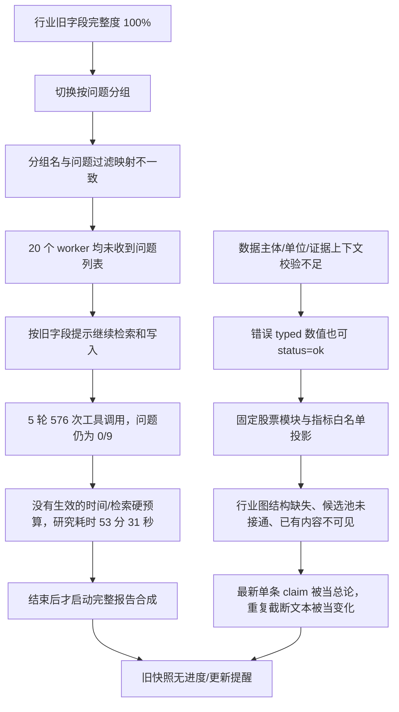

# AI for Science 研究运行与档案体验：归因和优化方案

> 审计日期：2026-09-08。现场核查截至北京时间 22:36，已追踪到本次命令结束与报告发布。
> 对象：`live-a2cce641` / `cmd-8375cabf` / `plan-bf18763bd2`；用户提供的冻结快照 `dossier-ai-for-science-790aa7547ee5`。
> 依据：实际浏览器页面、localhost API、`data/events.db`、`data/kb.db`、`data/metrics.db`、当前源码与设计文档。数据库均以只读方式检查；本次不改服务、研究数据或执行配置。
> 范围：工程和研究产品质量审计。下文公司的金额只是系统内部数据一致性案例，未重新核验外部披露，不构成新的公司研究结论。

## 1. 结论

目前具备了 Dossier、Plan、Observation、Claim、Artifact 等基础对象及部分连接，但这次真实的“行业 + deep + 已满旧档案 + 自定义研究目标”流程没有完成产品闭环。

问题主要沿两条链发生：



优先修复问题分发、数值准入和预算，再完成目标导向的行业产物与页面。单纯延长等待、更换模型、增加搜索源或调整颜色，都无法解决上述断点。

## 2. 本次运行的事实基线

实际命令：

```text
/research industry:ai-for-science --depth=deep 究竟哪些公司是真的在形成技术护城河以及有比较大可能能够取得商业爆发
```

以下时间统一为北京时间（数据库记录为 UTC）。

| 事件 | 时间或结果 |
| --- | --- |
| 发起命令 | 21:31:50 |
| 预检结束、研究开始 | 21:32:08 |
| 用户所给快照生成 | 22:15:59 |
| 研究阶段结束 | 22:25:39；耗时 53 分 31 秒 |
| 研究停止原因 | `budget`，达到 5 轮限制；充分度 `partial` |
| 关键问题进展 | 0/9；`answer_question` 调用 0 次；问题更新事件 0 次 |
| 报告合成开始 | 22:25:39 |
| 截至 22:30 中间采样 | 仍在合成；该行业尚无冻结 ResearchArtifact |
| 最终报告/新快照发布、命令结束 | 22:31:39；命令总耗时约 59 分 49 秒；报告合成约 6 分钟 |
| 最终报告 | `artifact-d51c04aead02`，draft / partial；一项硬错误、八项裸数字未绑定观测警告 |
| 最终新快照 | `dossier-ai-for-science-4a8e7d5e6bd9`；用户原链接仍固定旧版本 |
| 父会话总结 | 22:33:02 输出；依然复述末轮 12 字段/9 typed，建议再次研究，但没有定位问题分发故障 |

因此，页面上的“刚刚”不能理解为刚开始运行，它来自最近事件时间；本次持续时间比用户观察到的等待窗口更长。父 run 的核心事件可用 seq `188261`（命令）、`188263`（研究开始）、`195910`（研究结束）、`195911`（合成开始）复核。

| 研究阶段统计口径 | 数量 |
| --- | ---: |
| 轮数 / worker 任务 | 5 / 20 |
| 模型调用步骤 | 236 |
| 所有工具调用 | 576 |
| 外部 `query_*` 调用，不含 query_kb | 128 |
| 其中 Exa 搜索 | 84 |
| 另计正文抓取 | 63 |
| 证据登记尝试 / 被拒 | 250 / 44 |
| 成功旧字段写入事件，非去重字段数 | 46 |
| 新观测 / 论断 / 计算 | 15 / 10 / 4 |
| 提交问题答案 | 0 |

Sessions 的结束摘要只显示“12 字段、9 项 typed”，是末轮统计，不是五轮累计。这又削弱了用户对投入与成果的判断。最终流程显示 completed，但研究仍 partial、报告仍 draft；界面需要明确“执行结束”和“成果可用”之间的区别。

用户给的快照冻结得更早，包含 **36 个 Fact、11 个 Observation、10 个 Claim（9 validated、1 draft）、2 个计算**。它不是空档案，但首页三个 KPI 全缺失、驱动链为空、研究 0/9、报告 0 份。

| 快照模块 API | 实际表现 |
| --- | --- |
| 产业链 | 2,757 字叙述，nodes=0、edges=0 |
| KPI | series=[] |
| 财务 | FY=[]、Q=[]，仅两项计算 |
| 候选池 | peer_series=[]，回退三个旧字段 |
| 风险 | claims=[]，回退三个旧字段 |
| 子赛道 | 状态 missing，payload 却是公司收入系列 |

## 3. 根因与修复落点

### 3.1 P0：计划已创建，但问题没有分发给执行者

`_question_groups()` 用问题的 module 原名创建 worker 组；`_group_plan_view()` 又将 module 映射为旧维度名再比较。

| 实际创建的 worker 组 | 过滤问题时变成 | 结果 |
| --- | --- | --- |
| industry_chain | landscape | 不匹配 |
| key_kpi | financial | 不匹配 |
| candidate_pool | landscape | 不匹配 |
| catalysts_risks | risk_mgmt | 不匹配 |

这不是仅凭代码推测：本次 20 条 worker 输入均不含“本轮研究计划”，也没有计划 question_id。它们有原始目标，却没有必须验收的具体问题，因而在做自由采集和字段更新。

落点：[loop.py](../src/finance_agent/research/loop.py)，`_question_groups` 第 134 行、`_group_plan_view` 第 593 行。旧字段分组路径还有行业 KPI 被映射到股票 financial 组的问题。

修复方案：

- 建立唯一的 `entity_kind + module → worker_group` 映射，建组和过滤复用它。
- 更稳妥地，调度器直接产生 `WorkItem(question_ids, module_ids, scope, acceptance)`；worker 接收显式 question_ids，不再自行推导。
- 启动前断言：待执行问题集合被完整分配；有待执行问题时禁止创建空问题 worker；引用未知 question_id 的 claim 不能正式归档。
- plan 模式使用专门提示词：证据、分析、反证、提交答案；旧字段补全只作为兼容副产物。
- 连续一个调度周期无问题推进即触发具体诊断，区分问题未分发、提交失败、来源不可得和分析未完成。

验收：用本次“完整度 100% 的行业档案 + deep”场景贯穿真实 CommandRunner、分组、worker 输入和答案落库；九个问题必须全部进入执行上下文，不允许仅分别单测两个映射函数。

### 3.2 P0：结构化数值已发生真实的主体和量纲错误

`typed` 当前主要保证可解析和换算链一致，没有充分保证数字对应哪个主体、哪一列、什么经济含义。

| 观测 ID | 系统保存值 | 可核对的问题 |
| --- | --- | --- |
| obs-1ce021570310 | `sdgr_top20_kpi=73700000`，unit=ratio，currency=USD | 摘录是 `$73.7 million, or 37%`；金额被作为比例保存 |
| obs-723282fae4d1 | `xtalpi_major_deal_upfront=4 USD` | 摘录及 raw 是乱码；关联 claim 自己说潜在总额、首付款未拆分，metric 却叫 upfront |
| obs-79a868c353bb | `revenue=106303 USD` | 摘录只有 `106,303 27,456`；关联 claim 写约 106.3 百万美元，内部量级矛盾 |
| obs-cf01ee8416d6 | `revenue=193518 CNY`，segment=AI for Science | 摘录只有 `193,518 81,864`，没有公司、表头、币种或规模词，无法证明标准化金额 |

这些观测均为 `status=ok`。不同公司的收入还被强制记在 `industry:ai-for-science` 上，部分 dimensions 为空。两项收入增速能够算对，并不能证明金额正确：分子分母都少三个零时，同比增长不变。

落点：

- [tools.py](../src/finance_agent/research/tools.py) 第 295 行：观测主体强制等于研究实体。
- [normalization.py](../src/finance_agent/knowledge/normalization.py) 第 131–151 行：多数字文本仍优先选择规模词附近/首个非年份数字，未按指标量纲选定值。
- 同文件第 273 行：未声明规模词且摘录数字后没有规模词即可通过；裁剪成裸数字的摘录无法检验表头单位。
- [metric_writer.py](../src/finance_agent/knowledge/metric_writer.py) 第 85 行附近：引用、时间、血缘检查不等于表格语义检查。

修复方案：

1. 分开研究范围 `scope_entity` 与指标主体 `subject_entity`。公司财务写公司实体，行业通过候选关系读取；多主体研究应在授权研究范围内验证跨实体引用，不能简单放开所有引用。
2. 引入统一 MetricSpec：指标经济含义、金额/比例/数量、允许的单位和币种、主体类别、期间、维度、合法范围。比例禁止 USD；收入和合同潜在总额、已收首付款分别建指标。
3. 财务证据绑定 `document → page/table → row/column → cell/span`，同时保存公司、期间、币种、数量级。只有裸数字的摘录不能直接变成可靠金额。
4. 多数字输入要求显式 cell/span，禁止从 `$73.7 million, or 37%` 猜用户要哪个数。
5. PDF 抽取加可读性检查；乱码转 `needs_ocr/unavailable`，只有经过可靠抽取或人工核对才允许进入指标库。
6. 对本次错误观测及其派生计算建立修订/失效记录，重审依赖 claim，生成新快照；保留旧版本审计链，避免原位修改冻结历史。

验收：以上四例都不能再次以 `ok` 错误入库；相同期间不同公司的收入不能形成同一指标序列；金额与比率必须同时通过来源和量纲验证。

### 3.3 P0：时间和检索预算未生效，慢 worker 拖住整轮

设计建议 deep 模式 40 分钟、80 次检索、最多四 worker、五轮。代码实际只消费轮数，每组再固定最多 12 个模型步骤。五轮四组可产生约 240 个模型请求，本次是 236 次。

五轮耗时依次约为 **9:28、3:49、13:15、10:01、16:58**。模型调用区间累计约 6,030 worker 秒，所有工具执行区间累计约 425 worker 秒。二者都是并发累计，不能直接当作墙钟占比；但足以说明主要等待集中在模型侧。单次模型步骤中位数 13.6 秒、P95 82.2 秒、最长 355 秒；key_kpi 的 GLM worker 在四轮构成尾部等待。

事件中已上报 usage 的累计下界约 **633 万 tokens**，其中 prompt 约 612 万。部分调用缺 usage，所以这不是完整账单，也不等于独立资料量。工具响应累计约 196 万字符，kernel 多步重送历史，资料量和上下文成本持续放大。

落点：[plan.py](../src/finance_agent/research/plan.py) 第 31 行预算定义；[loop.py](../src/finance_agent/research/loop.py) 第 301–311 行整轮等待、第 463 行轮次预算、第 568 行固定步数；[kernel.py](../src/finance_agent/loop/kernel.py) 第 72 行附近请求循环。

修复方案：统一 RunBudget，在 LLM 和 Gateway 入口真实扣减 wall-clock、tokens、检索、总工具数与重试预算；单请求 timeout 不超过剩余时间；按问题完成即验收，避免整轮屏障；慢组超时只影响所属问题；资料通过按需 evidence bundle 读取、去重、摘要和上下文压缩控制增长。预算预留最后一段用于部分成果合成。

验收：故障注入时结束时间不超过配置 deadline 加明确的取消容差；80 次检索上限定义完整并真实生效；新预算同时用于重试与子任务；缺 usage 不能按零计费。

### 3.4 P1：用户目标没有被编译为公司级研究交付

standard/deep 直接套配方 core/extended 问题，objective 只是存储字段。只有 targeted 分支直接用目标构造问题。本次九题主要是产业链、供需、政策、周期，不能单凭答完它们就证明回答了“哪些公司真正形成护城河并可能商业爆发”。

落点：[plan.py](../src/finance_agent/research/plan.py) 第 277、303、325 行；[industry.yaml](../playbooks/research/recipes/industry.yaml)。

应先建立目标相关的公司比较问题，再补行业背景。每个候选至少回答：

- 技术壁垒：独占数据、模型与实验闭环、外部验证、替代方案和复制难度。
- 商业兑现：收入、已收款、首付款、潜在里程碑、合同上限分开；增长来自什么。
- 可持续性：复购/扩单、交付能力、客户集中、毛利与现金消耗；未披露明确留空。
- 反证：哪些证据削弱优势，什么事件会证伪，下一次何时能验证。
- 可投资范围：上市状态、市场、证券与公司关系；未上市公司可作为技术参照，但不混入可交易候选。

“商业爆发概率”没有可校准数据时，用证据支持的阶段和条件表达，不自动制造百分比或总分。

验收：用户目标对应明确的高优先级问题、候选比较产物和首屏结论；背景问题完成不能代替目标完成。

### 3.5 P1：证据表示和 PDF 质量问题造成误拒与低质量输入

证据基准保存为 JSON 序列化字符串，核验却用原文子串匹配；换行、引号被转义后，模型复制真实正文也可能被拒。本次 44 次拒绝中，事件重放至少能确认九次 quote 是解码正文的逐字子串，不能全部归因于模型编造。

落点：[gateway/tools.py](../src/finance_agent/gateway/tools.py) 第 31 行、[evidence_desk.py](../src/finance_agent/research/evidence_desk.py) 第 98 行；[fetch.py](../src/finance_agent/gateway/fetch.py) 第 35 行附近 PDF 抽取无充分乱码/表格质量检查。

修复：台账保存规范正文与 locator，JSON 只负责传输；工具返回稳定 span ID，登记工具优先引用 span。抓取质量必须单独标记，PIT A 只说明时间来源性质，不能表达文本可读性和数字可靠性。按拒绝码反馈可修复原因，防止反复重试或缩短摘录丢失语义上下文。

### 3.6 P1：行业配方没有控制模块和组件

行业 recipe 定义六个模块，但后端遍历固定十个股票模块，前端也有固定 SECTION_ORDER，只做四个标题替换。结果是行业页面仍占用财务、预期、估值栏目，“子赛道”实际读取公司收入，“候选池”从 peers 字段找代码，与已有 player_landscape 不连通。

落点：[projector.py](../src/finance_agent/dossier/projector.py) 第 47、425、476 行；[StockDossierPage.tsx](../frontend/src/pages/StockDossierPage.tsx) 第 16 行；[service.py](../src/finance_agent/dossier/service.py) 第 238、344、597 行。

同时存在数据适配缺口：KPI 只读 market_size/growth_rate/capacity_supply；公司 KPI 因名字不同不可见；财务只读 FY/Q，本次 H1 数据被排除；带 dimensions 的 KPI 又被过滤；claim 大多没有 question_id，三条误用模块名 key_kpi，模块关系也没有统一校验。

修复：由同一个版本化注册表定义 `问题 → 指标/产物 → 模块 → payload schema → renderer → applicability`。行业与股票共用格式化、来源和图表基础设施，各自有合适的信息架构；不适用项应为 not_applicable 或隐藏于默认导航，不能当作研究缺失。

### 3.7 P1：可视化需要的结构产物从未生成

`business_graph()` 只拼接旧 value_chain/competition/sub_sectors 文本，不填 nodes/edges；前端也没有真正消费 edges。实际页面因此显示长文本和原始 JSON。“无流量所以不画 Sankey”不妨碍画带证据的产业链关系图。

落点：[projector.py](../src/finance_agent/dossier/projector.py) 第 800 行；[modules.tsx](../frontend/src/features/dossier/modules.tsx) 第 209、605 行。

需要新增或补完四类结构产物：

| 产物 | 必备内容 | 页面形式 |
| --- | --- | --- |
| IndustryMap | 分层节点、技术路线、上下游边、瓶颈、公司引用、证据 | 可点击分层关系图；未知流量用等宽边 |
| CandidateAssessment | 公司、上市状态、技术与商业证据、反证、入选/淘汰/待核实原因 | 公司证据矩阵、筛选和公司深链 |
| ComparisonMatrix | 同期间同口径数据及不可比原因 | 对照表；满足可比条件才绘图 |
| ValidationTimeline | 事件、时间范围、触发条件、受影响判断 | 验证时间线，标已发生/预计/未知 |

合成器负责产出结构化候选，服务端验证，projector 确定性投影；不要在读页面时调用 LLM 临时生成图。

### 3.8 P1：首屏摘要、变化和可信度表达不正确

首屏直接取最后创建的 validated claim 作为总论，而非按用户问题综合。最近变化是最后三个 claim 各截 120 字；最大反证截 200 字。实际页面出现两条近重复变化、反证在“68% vs 传统 3”处截断、关键驱动留空。行业驱动为空还因为代码只识别三个股票问题 ID。

`validated` 目前只说明支持/反方引用可解析且上下文通过，不验证证据是否充分支持整句话。事件明确记录 `checks=[support_refs_resolvable]`，首屏却显示绿色“已验证论断”。limitations 和首屏引用没有显示，verdict=null 时连 0/9 也隐藏。

落点：[projector.py](../src/finance_agent/dossier/projector.py) 第 295–342、453–459 行；[tools.py](../src/finance_agent/research/tools.py) 第 379–411 行；[components.tsx](../frontend/src/features/dossier/components.tsx) 第 49–99 行。

修复：

- ExecutiveSummary 必须回答目标，包含候选分层、主要依据、最大分歧、限制和引用。
- 变化依据 baseline 与新快照的 claim 修订、新指标、新证据和状态改变，不能按最新三条代替 diff。
- 摘要保留完整句，正文可展开；限制与反证不被硬截断。
- 明确拆开引用可解析、事实已核对、分析已复核、研究充分度；沿用现有能力时只写“引用通过基础校验”。
- 无论是否已有 assessment，始终显示问题进展和研究中/部分成果状态；首屏结论与来源一键连通。

### 3.9 P1：部分发布、合成与实时进度没有闭合

研究完成后才进入最长 12 步的单一合成 agent；它查询 KB、指标和 claim，再逐条读取证据。输入未直接带用户 objective、完整 plan、assessment、计算与问题证据包。submit_report_document 先返回 accepted，最终才校验，失去同轮反馈修复机会；产物 calculation_ids 固定为空。

只有最终 `_finalize_artifact_v2()` 发布 Dossier；取消路径可能直接结束，已有有效成果没有统一 partial finalize。快照固定到 URL 是正确的历史一致性设计，但页面没有运行进度订阅和新快照提醒。

落点：[steps.py](../src/finance_agent/commands/steps.py) 第 185、428–479、621、653、701 行；[runner.py](../src/finance_agent/commands/runner.py) 第 370 行；[StockDossierPage.tsx](../frontend/src/pages/StockDossierPage.tsx) 第 53–85、192 行。

修复：每完成一个问题/模块就校验并冻结 partial artifact；合成读取已经整理好的问题证据包与计算引用；提交时即时校验并返回可修复错误。所有终止路径保留 stop_reason 和已验证成果；checkpoint 保存输入 hash、依赖和执行位置。页面另行订阅运行进度，提示新版本和 changed_modules，由用户整体切换快照。

最终状态补充：22:31:39 产物校验确认 `claim-a4654b90f0d9` 引用了不存在的 `fact-commercial-breakout`，触发 `unresolved_claim_ref` 硬失败（事件 seq 196202）。该 claim 早已为 draft，但第 646–652 行把当前实体所有 draft/validated claim 一并挂到报告，错误草稿也进入正式报告依赖集合。应只纳入报告实际引用且经校验的依赖闭包；未通过的草稿保留于审计/缺口区，修正或剔除不采用的论断后重新校验，不能靠关闭校验通过。八个事实数字未绑定观测还只是软警告，关键数字应按所处语义块和 MetricSpec 设硬门禁。

最终报告的 `calculation_ids=[]`、`snapshot_refs=[]`，虽有单独 report/published 事件关联新快照，artifact 自身的计算与快照依赖仍不完整，须纳入发布闭环修复。最终新快照可从 [发布结果](http://127.0.0.1:8000/#/knowledge/industry/ai-for-science?snapshot=dossier-ai-for-science-4a8e7d5e6bd9) 查看；这只代表新版本已生成，不代表本报告指出的问题已修复。

## 4. 面向这次需求的目标页面

首页首先回答“哪些公司、依据是什么、还差哪一步验证”，背景行业介绍放到后面。建议六个阅读分组：

| 分组 | 主要内容和交互 |
| --- | --- |
| 研究结论 | 目标、当前部分结论、候选分层、最大分歧、问题覆盖；明确仍未核验的部分 |
| 产业链与技术路线 | 上游基础设施→模型/数据/实验平台→应用，节点关联公司和瓶颈 |
| 公司与护城河 | 一家公司一行；证据支持的优势、复制难点、商业验证、反证；可展开来源 |
| 商业兑现 | 收入/合同上限/已收款分层；H1/FY/Q 明确区分；数据可比再画图 |
| 催化与证伪 | 临床/产品/交付/财报等验证节点，展示条件而不是无依据的概率 |
| 研究过程与来源 | 已完成和未完成问题、来源质量、争议、版本变化、全文报告 |

首屏可先展示有证据的候选比较表；不应为了凑三个行业 KPI，把当前目标不依赖的市场规模缺口作为视觉中心。双轴“技术验证阶段 × 商业兑现阶段”可用有明确定义的离散分类；没有可比口径时保留矩阵，不制造精确坐标。

主要交互必须走通：**公司判断 → 指标/证据 → 原文上下文 → 返回同一公司与同一快照**。行业图的节点和公司行可联动高亮，点击缺口可直接补研相应 question_id。

## 5. 实施顺序与验收

以下是基于当前代码规模的粗估，按一名熟悉仓库的工程师计；不是运行耗时承诺。前后端并行须先冻结契约。

| 阶段 | 工作 | 粗估 | 完成标准 |
| --- | --- | --- | --- |
| A：阻断错误和空转 | 问题分发统一、MetricSpec/主体/证据上下文准入、真实预算、真实质量文案；错误数据版本化修订方案 | 2–3 工程日 | 本次失配和四个错误数值样本不能再复现；预算和取消生效 |
| B：研究交付闭环 | 目标拆题、候选比较产物、问题验收、证据包、partial 发布、合成即时校验 | 4–6 工程日 | 运行中出现可读成果；结束能回答目标或明确未解决原因；计算引用不丢 |
| C：行业页面与现场验收 | 配方驱动模块、产业链/公司矩阵/时间线、H1、来源、真实 diff、新快照提醒、三档视口 | 3–5 工程日 | 真实快照与页面一致，核心任务可完成，不显示原始 JSON 堆砌 |

整体约 9–14 工程日；外部数据质量、OCR 选择和真实运行评估可能增加工作量。先用现有证据完成可复核闭环，再按缺口决定是否扩展来源。

建议新增这些验收用例：

1. **问题分发装配回放**：生产旧档案 100% + industry deep，真实 runner 和真实分组逻辑，仅在网络/LLM 边界替换；断言所有问题进入 worker。
2. **错误数据四例**：多数字金额/比例、缺表头量级、乱码潜在合同/首款、跨公司收入；错误输入必须拒绝或待复核。
3. **来源真实性**：换行、引号和中文标点不误拒；改写和不在所选表格的数字仍拒绝。
4. **预算/慢组故障注入**：超时、重试、取消、token 缺失、provider 降级；断言实际停止、partial 保留、原因可见。
5. **真实产物回放**：行业图有带证据的 nodes/edges；候选池有公司和原因；合法问题的 claim 进入正确模块；H1 不丢失。
6. **页面与快照**：0/9 在研究中可见；首屏摘要和限制可回源；收到新版本只提示，不混换旧快照；变化不是重复文案。
7. **视觉验收**：1440/1024/390 三档；正文可读、JSON 不直接占据阅读区、来源抽屉可返回、表格内部滚动。
8. **研究效果评估**：同目标、同证据截止、相近预算比较修复前后；统计有效问题覆盖、关键数值错误、来源可解析率、重复资料、有效产出时间和成本。内容更长、测试更多不能替代这些结果。

性能体验先作为待校准的验收目标：任务启动即显示研究目标与当前问题；每 30 秒更新执行活性和等待原因；争取 2–3 分钟内形成第一份经校验的局部成果，若尚无成果则显示具体阻塞；deep 默认全局 40 分钟含预留合成时间，超时可读地交付 partial。

## 6. 对“开发完成”的判断和保留边界

[实施状态文档](knowledge-dossier-implementation-status.md) 明确承认 wall-clock 硬预算、档案 published 推送、真实浏览器截图、部分来源与行业增强没有完成。当前测试更多证明基础对象、单股 targeted 脚本路径和局部回归，不足以证明真实行业深研已达到 [设计](knowledge-dossier-research-redesign.md) 的最终验收要求。

具体测试缺口：`tests/integration/test_research_dossier_e2e.py:60` 的 MockLLM 预设正确 question_id 和 answer_question；`tests/unit/test_research_loop_v2.py:356,380` 分别验证映射和分组，没有贯穿二者；`tests/unit/test_review_fixes.py:588` 的行业用例主要断言改标题、有叙述和引用，未要求关系图与候选池完整可用。本次没有重跑全套测试，也没有重新发起昂贵研究。

相邻风险：本次实际走 `/research industry:...`；另一个 `/industry` 入口仍使用旧 F1–F5 路径，部分步骤未装配 plan/typed/synthesize。该入口不是本次直接原因，但后续必须统一核心研究服务，避免同一行业从不同入口得到不同质量。

建议将状态修订为“基础契约与部分单股链路已完成，行业深研与生产质量验收进行中”，以本次可复现样本作为下一阶段的交付基线。
