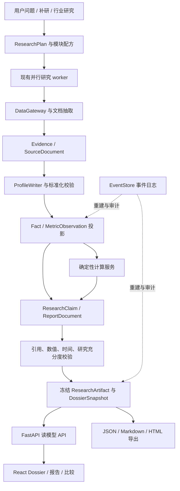

# Knowledge 可视化档案与 Research 深度升级设计

> 版本：v1.0 · 2026-09-07 · 状态：待实施的工程设计，本文不代表功能已经上线。  
> 代码基线：`c3e02eb`；以实际源码为准，早期 handoff 中的完成状态不作为现状依据。  
> 设计输入：[股票档案网页方案](chatgpt-conversation://6a9e4fc0-2984-83e9-bc1a-c76220f70646)、[总体设计](../DESIGN.md)、[调研能力提升设计](research-capability-upgrade.md)、现有前后端与事故复盘。  
> 适用范围：单机 Finance Agent 的 Knowledge、单标的 Research、行业研究结果联动及档案导出。本文提出改造方案，不执行研究任务、生产数据迁移或网站部署。

阅读导航：[现状与缺口](#2-当前项目审计已有能力与实际缺口) · [页面设计](#4-页面信息架构与视觉规格) · [数据契约](#6-数据模型与-stock-dossier-契约) · [研究升级](#7-research从字段补全升级为问题驱动的深度研究) · [计算与估值](#8-计算预期与交互模型) · [API](#10-api前端模块与事件联动) · [迁移](#11-迁移与兼容方案) · [实施计划](#12-实施计划与工程落点) · [验收](#13-验证与验收)。

## 1. 推荐方案与核心决策

将 Knowledge 升级为**由结构化研究数据驱动的股票研究档案**。用户先看到公司、核心变化、业务驱动和风险，再进入财务、预期、竞争、管理层和原始证据。Research 同时从“补齐档案字段”升级为“按研究问题建立证据、分析因果、寻找反证并验证结论”。

关键交付链路是：

**研究任务 → 证据与标准化指标 → 分析与计算产物 → Stock Dossier JSON → React 档案 / 研究报告 / 冻结导出。**

这不是新增一份由模型任意生成的 HTML。不同股票共用页面组件；行业差异由指标模板和模块配置表达。JSON 是经过校验的读模型，底层事实、事件和证据仍然独立保存。

| 决策 | 推荐做法 | 原因 |
| --- | --- | --- |
| 前端技术栈 | 保留 React + Vite + TypeScript + Tailwind | 当前应用为本地研究工作台，没有为此迁移 Next.js 的必要 |
| 主阅读体验 | React 原生档案；旧字段视图改为“数据与审计” | 解决 iframe、阅读断层、来源无法联动的问题 |
| 图表 | ECharts 为财务主库；价格交互成熟后按需加 Lightweight Charts | 先建立统一图表契约，控制依赖数量 |
| 数据入口 | 继续统一走 DataGateway | 新源同样受 PIT、预检、限流和审计约束 |
| 数据存储 | 保留 SQLite、Evidence、Fact、ProfileWriter；增量增加指标和研究产物模型 | 无需同时重写数据库、编排器和页面 |
| 研究终止 | 基础档案覆盖 + 问题覆盖 + 证据及分析验证 + 预算共同决定 | 当前 80% 字段完整度不足以证明深研完成 |
| 事实与判断 | 分离 reported / calculated / guidance / consensus / model / analysis | 防止预测、推论、真实披露混在一起 |
| 历史查看 | 所有模块共用冻结的时间与快照上下文 | 表格、图表、来源、质量和研究结论必须来自同一可见世界 |
| 建议边界 | 买卖评级、仓位和建议价格区间仍归 `/decide` | 延续既有 D1 裁决，不由 Knowledge 自动制造决策卡 |
| 首发顺序 | 先打通一只股票的“数据—研究—档案—来源”闭环，再推广行业模板 | 页面质量与研究质量可以同时验收 |

### 1.1 对引用方案的吸收与调整

吸收四项主线：Business Engine（公司如何赚钱）、Expectations（预期差）、Reverse DCF（价格隐含的假设）、Source Traceability（结论回指证据）。保留行业适配、情景交互、电话会变化与管理层兑现分析。

结合本项目作以下调整：

1. 引用方案的 22 个章节收敛为 8 个阅读分组、10 个首发模块；高级能力按数据可得性分期。
2. 不采用第一屏“投资观点 4.3/5”这种缺乏校准的总分。第一屏给研究结论、支持证据、最大反证与研究覆盖；已有 DecisionCard 单独引用并显示日期。
3. 不默认安装 OpenBB、FinanceToolkit、EdgarTools 和多个图表库。先扩展已有 adapter 与 `calc`，外部库按具体缺口选择。
4. 保留股票和行业两种实体。行业页面展示产业链、瓶颈、候选池、比较与淘汰逻辑，不套用个股 EPS 页面。
5. 历史研究与当前视图分开处理。不能把今天生成的分析标成“当时的投资观点”。
6. 引用方案中的公平价值/目标价滑块在本项目拆成研究假设实验与 `/decide` 决策输出，具体见 §8.4。

### 1.2 本期范围

本设计覆盖浏览、研究、计算、证据回指、历史快照、导出、迁移及质量验收。自动下单、实时交易终端、全市场无限扫描、多租户服务和数据库集群不在本期。对外商业化或数据再分发应在发生时另做数据许可与部署设计。

## 2. 当前项目审计：已有能力与实际缺口

### 2.1 可复用基础

| 能力 | 源码落点 | 当前实现及改造价值 |
| --- | --- | --- |
| Knowledge 列表及详情 | `frontend/src/pages/KnowledgePage.tsx` | 已有完整度、质量状态、事实展示、冲突裁决、历史、简单图表、HTML 存档；不是空白页面 |
| 页面导航 | `frontend/src/App.tsx` | 现有顶层 hash 导航；需要实体、章节、时间、来源级深链 |
| 图表与数据请求 | `frontend/src/components/MiniChart.tsx`、`frontend/src/api.ts` | 可复用请求及错误处理思路；现有图表不足以承担规范化财务分析 |
| 知识读接口 | `src/finance_agent/api/app.py` | entities/profile/series/compare/archives 和裁决已存在；profile 内嵌证据，series 暴露版本链，没有独立 history 端点 |
| 事实和证据 | `knowledge/models.py`、`store.py`、`writer.py` | 双时态、命名空间、单写者、版本链与证据绑定继续作为基础 |
| 质量准入 | `knowledge/verify.py`、`gaps.py` | 已有空值/占位符/类型准入、读侧质量、weak 回流；应向语义和研究深度扩展 |
| 研究循环 | `research/loop.py`、`evidence_desk.py`、`tools.py` | 缺口驱动、维度并行、原文验证、停滞诊断和工具纪律可复用 |
| 单票与行业管线 | `commands/registry.py`、`steps.py` | 已有 research/synthesize/profile、行业 F1–F5、thesis、委员会、排序和报告事件 |
| 计算 | `research/calc.py` | Decimal 市值验算、来源对比、EPS 三情景、估值快照已经实现 |
| 数据采集 | `gateway/adapters/`、`gateway/fetch.py` | EDGAR、HKEXnews、搜索、新闻、基本面、行情及 PDF 抽取已有入口；本次未重新测其网络可用性 |
| 静态存档 | `knowledge/render.py` | 内容哈希和按需生成可复用；不再作为主页面的信息架构 |
| 防穿越与决策 | `knowledge/snapshot.py`、`gateway/gateway.py`、`decision/`、`evaluation/` | 保留风险审查、快照绑定、评估隔离和失败可见性 |

以上是代码审阅结论，不是本次全量测试或真实网络联调结论。仓库 `docs/demo/` 和 `docs/samples/` 可用作布局与内容结构参考，其中示例数字、内嵌旧引用标记不能直接成为生产数据。

### 2.2 必须优先解决的缺口

| 问题 | 可核查事实 | 影响 | 本次设计处理 |
| --- | --- | --- | --- |
| 字段完整 ≠ 研究充分 | `research/loop.py:172,260` 按完整度目标与 required stale 判断收敛；默认目标为 0.8 | 新问题、反证、optional/weak 和冲突可能未解决就结束 | 增加 ResearchPlan、问题队列和 ResearchAssessment |
| 8 个基础字段粒度过粗 | `knowledge/schema.py:33` 的 required 为财务、估值、业务、护城河、风险、peers 等 | 一段文字可填满整组，但无季度、分部、KPI 和兑现记录 | 旧 schema 保留兼容，新增模块契约与研究配方 |
| 文本被猜成数值 | `KnowledgePage.tsx:14` 的 `toNumber()` 取首个数字；`FactCharts` 按字段名猜指标 | 年份、单位、货币可能被错误绘图 | 图表仅消费服务端 NumericObservation/CalculatedMetric |
| 事实版本链与业务时序混合 | `knowledge/store.py:204` 每 field 取最新版；history 是更新版本链 | 同期重述被当成新季度，财务时间轴失真 | 增加指标语义键、期间维度、重述与冲突投影 |
| 历史图与正文上下文不一致 | 详情有 as_of，但 `FactCharts` 的 series/compare 调用未传相同截止时点 | 历史正文旁可能出现今日图表 | 统一 DossierContext、快照分页与时间锁 |
| 数字校验覆盖不足 | `knowledge/guard.py:29` 对非顶层 int/float 放行 | 字符串和嵌套对象里的数字未获同等保护 | typed 数值入口及逐叶校验；保留原文与显式换算链 |
| 计算结果缺来源契约 | `research/calc.py:165` 的工具返回 `provenance: []`，输入未绑定 fact/evidence id | 图上计算值无法完整重算和回指 | 增加 CalculationRun，引用输入并记录公式版本 |
| 历史冲突状态不冻结 | `store.py` 的 resolve 原位清 conflict_flag；open_conflicts 无 as_of | 今日裁决可能改变历史质量显示 | 新增带生效时刻的裁决事件投影，历史不可借用未来裁决 |
| 单票报告偏薄 | `steps.py:235` 的合成契约只有 7 个大节，`step_synthesize` 为最多 8 步的合成 | 受档案内容上限约束，没有问题级研究与模块产物 | 分章节结构化写作、事实检查、共用文档模型 |
| 完成状态与内容质量分离不够 | `step_synthesize` 空档案也可发布缺口说明并返回 completed | UI 容易把执行完成解读为可用研报 | 分离 RunStatus、产物状态和研究充分度 |
| 两套阅读器 | React 事实表与 Python HTML 模板独立组织内容 | 排版和口径漂移，来源抽屉难联动 | 共用 Dossier 与 ReportDocument 契约 |
| 现有 thesis 混合事实与判断 | `step_thesis`、`step_profile_update` 将论点写入 KB 的 `thesis` 字段 | 不能把旧 thesis 自动标成披露事实 | 兼容为 legacy analysis，后续写入 ResearchClaim/Artifact |

## 3. 产品目标与用户路径

### 3.1 三层阅读

| 时长 | 用户需要回答 | 页面优先呈现 |
| --- | --- | --- |
| 10 秒 | 公司做什么？最近什么变了？主要机会与风险？ | 身份、少量核心指标、研究结论、三个变化、最大反证 |
| 2–5 分钟 | 怎么赚钱？增长靠什么？预期高不高？ | 业务流、分部、KPI、财务、预期与估值假设 |
| 10–30 分钟 | 数据可靠吗？哪一步会失效？管理层有没有兑现？ | 指标口径、完整研报、原始文档、反证、情景、历史比较 |

“更详细”通过覆盖的问题、证据深度、可重算模型与反证体现。字数只用于阅读成本估计，不用于研究完成门槛。

### 3.2 关键用户流程

1. **打开股票档案**：Knowledge 搜索/筛选 → 公司概览 → 点击“收入增长的驱动” → KPI 图与解释 → 点击数值 → 原文与计算链。
2. **针对缺口补研**：某模块提示“最近两季 backlog 缺失” → 选择“补研此问题” → 进入现有 Sessions 执行 → 展示问题进度 → 新快照准备好后提示“本轮改变了 3 条结论”。
3. **主动深研**：输入 `/research BE` 或自然语言 → 显示研究目标与范围 → 自动采集/分析/反证 → 部分成果先读 → 完成后进入档案与完整报告。
4. **查看历史**：选择知识截止时间 → 正文、价格、来源、质量与比较一起切换 → 查看当时已有报告；若只有今天重建的历史数据，明确标“基于历史证据重建”。
5. **行业到个股**：行业地图 → 瓶颈节点 → 候选池 → 同口径比较 → 个股；保留未入选原因、超时、数据不足、研究否定之间的区别。
6. **阅读已有决策**：档案中的“关联决策”显示 DecisionCard 日期与绑定快照 → 跳转 Decisions；研究更新不自动改写旧卡。

## 4. 页面信息架构与视觉规格

### 4.1 页面与路由

沿用 hash 路由部署方式，升级为可解析的路由对象；不要求服务端新增 SPA rewrite。以下为拟新增路由：

```text
/#/knowledge                                  档案库
/#/knowledge/stock/BE?section=overview          股票档案
/#/knowledge/stock/BE?section=financials&as_of=<ISO>&namespace=prod
/#/knowledge/stock/BE?section=sources&evidence=<evidence_id>&snapshot=<id>
/#/knowledge/industry/ai-for-science            行业档案
/#/knowledge/compare?entities=stock:BE,stock:... 比较工作台
/#/research/<artifact_id>                      冻结的完整研究报告
```

兼容 `#knowledge` 等现有入口。实体、章节、时间、快照、报告和证据必须能刷新恢复、前进后退；URL 参数统一编码，港股沿用 `normalize.py` 的规范化规则，原始别名保留用于检索。

### 4.2 Knowledge 首页

默认“研究档案”列表，提供股票/行业切换、市场、行业、待更新、冲突、研究状态筛选。每行回答“这是哪家公司、最新研究发现什么、现在缺什么”，而不是只显示字段数。

| 列 | 内容 |
| --- | --- |
| 公司/行业 | 名称、代码、市场、行业归属及来源 |
| 研究摘要 | 一句话结论与最近变化，截断后可展开 |
| 关键指标 | 行业模板指定的 2–3 个指标，带日期和口径 |
| 研究覆盖 | 已回答关键问题数 / 总数，最近完成日期 |
| 数据状态 | 缺失、陈旧、冲突、历史可用性；可点击过滤问题 |
| 动作 | 阅读、补研、比较、查看来源 |

提供紧凑表格与阅读列表切换；卡片仅用于最近更新/正在研究的小区域。列表请求失败必须显示失败与重试，不能伪装成“暂无档案”。

### 4.3 股票档案布局

```text
┌ 公司与代码  行业/市场       知识截止时间 · 数据更新时间  [补研] [导出] ┐
│ 股价*   市值*   收入增速   现金流/行业KPI   估值倍数*                 │
│ 研究结论：一句话解释核心逻辑     最近变化：① ... ② ... ③ ...          │
│ 关键驱动：需求 → 订单 → 交付 → 利润/现金流     最大反证：...           │
├ 章节导航 ──────────────────────────────── [来源抽屉按需出现] ─────────┤
│ 概览       章节结论                                                     │
│ 商业与KPI  主图：解决本章节最重要的问题                                  │
│ 财务       解释：发生了什么 → 为什么 → 哪些证据仍不足                    │
│ 预期估值   可展开数据表 / 原文 / 假设 / 与上次研究比较                    │
│ 竞争管理                                                               │
│ 风险催化                                                               │
│ 研究时间线                                                             │
│ 来源审计                                                               │
└────────────────────────────────────────────────────────────────────────┘
```

`*` 无可靠数据时显示缺口，指标栏允许减少；不能用零或旧模型估计补齐视觉空位。首屏约 5–6 个指标，根据行业替换。研究评级不与数据质量徽标共用颜色或文案。

### 4.4 十个核心模块与数据契约

| 模块 | 用户问题 | 主要内容与交互 | 必需输入 / 缺失降级 |
| --- | --- | --- | --- |
| 1. Investment Snapshot | 核心逻辑和最近变化是什么？ | 结论、关键驱动、最大反证、更新 diff | 已验证 claim 和指标；不足时显示研究草稿 |
| 2. Business Engine | 谁付钱，公司怎样赚钱？ | 客户→产品→收费→成本→现金流；逐步高亮 | 带来源的节点/边；无流量数据用流程图，不能编造 Sankey 宽度 |
| 3. Revenue & Segments | 增长来自哪一块？ | 堆叠柱、贡献变化、年度切换 | 同口径分部序列；缺分部仅展示总收入并说明 |
| 4. Key KPI | 什么领先指标决定未来？ | 3–6 个行业 KPI、因果边、监测阈值 | 时间序列、业务定义和关联 claim；未披露项保留缺口 |
| 5. Financial Quality | 利润是否变成现金？ | 收入/利润率、CFO→FCF、现金负债与稀释 | 标准化报表项与计算链；缺期保留断点 |
| 6. Expectations | 公司表现与预期差在哪里？ | actual/guidance/consensus 分层、发布前后对比 | 预测快照与发布时间；没有 consensus 就只比较指引 |
| 7. Valuation Lab | 价格要求怎样的经营表现？ | 倍数、反向求解增长、假设敏感性 | 可比口径的市场与财务输入；不适用时禁用模型 |
| 8. Peers & Competition | 增长、盈利、价格如何比较？ | 散点+可访问表格、优势证据矩阵 | 相同截止时点和期间口径；不满足则显示不可比原因 |
| 9. Catalysts & Risks | 何时验证？什么情况下失效？ | 催化时间线、风险信号、反证与假设联动 | 日期精度、触发规则、证据；未知概率不填百分比 |
| 10. Research & Sources | 判断来自哪里？本轮改了什么？ | 报告、filing/电话会时间线、来源抽屉 | artifact、source、claim、版本关系；旧资料仅按可知范围展示 |

完整目标包含十模块；第一个可上线切片优先完成 1、2、4、5、9、10 的基础版。6、7、8 以及分部深度依赖数据能力，不能以空图宣称完成。

### 4.5 视觉设计与交互优先级

| 优先级 | 规则 | 实施要求 |
| --- | --- | --- |
| 1 | 首屏投资信息清楚 | 结论、变化、驱动、风险分别有稳定位置 |
| 2 | 每章一个主要问题 | 标题用“现金流改善是否可持续”，避免单独写“图表” |
| 3 | 数字口径可见 | 单位、币种、期间、GAAP/调整后、估计类型出现在标题或 tooltip |
| 4 | 证据只需一次点击 | 数值与关键句共用 SourceDrawer，支持键盘与移动端 |
| 5 | 信息密度分层 | 主图旁短解释，长表与研究推导可展开；正文不整体截断 |
| 6 | 图表有可比较尺度 | 不随场景切换偷偷改变纵轴；变化时说明 |
| 7 | 排版稳定 | 桌面内容最大宽度 1440–1560px，正文列约 720–840px，间距 8px 基准 |
| 8 | 字体可读 | 公司名 36–44px、章节 24–28px、正文 15–16px、元信息至少 12px；数字等宽 |
| 9 | 颜色有含义 | actual 中性实线、guidance 紫色、consensus 蓝色、model 虚线；正负同时显示符号/文字，涨跌配色支持市场偏好 |
| 10 | 响应式完整 | ≥1280px 章节侧栏；768–1279px 顶部章节导航；小屏单列，来源抽屉全屏，数据表独立横向滚动 |

白/浅灰背景、深灰文字、低对比边框；减少整页重复卡片。默认不自动播放大范围滚动动画。业务链可分步演示，年份切换展示业务结构变化，假设调整展示结果变化；每次只有一个视觉焦点。尊重 `prefers-reduced-motion`，键盘操作与数据表提供同等信息。

### 4.6 来源抽屉与状态设计

SourceDrawer 展示：论断/数值 → 披露或计算类别 → 原文摘录与上下文 → 文档标题/发布者/URL → 文档日期、可知时间、获取时间 → 页码/章节/表格/单元格 → 输入与公式 → 竞争版本。无法确定页码就显示已有定位，不生成虚假精度。

状态至少分三轴，不能合并成一个“完成”：

- **运行状态**：现有前端为 `idle / running / done / error / cancelled`；v2 明确映射运行完成为 `completed`，等待审批/外部依赖作为新增投影状态，与总体设计的 RunStatus 语义对齐，不能把设计枚举误当已实现契约。
- **模块状态**：`ready / partial / missing / stale / conflicted / not_applicable / unavailable_at_as_of`。
- **研究产物状态**：`draft / validated / superseded`，另有充分度 `sufficient / partial / blocked`。

`validated` 表示通过本系统数据和引用检查，不表示人工审计或投资结论一定正确。原 `verified` 徽标在旧视图保留契约，新主页面使用“通过基础校验”解释其范围。

## 5. 目标架构与职责分工



| 层 | 拥有的职责 | 禁止承担的职责 |
| --- | --- | --- |
| Gateway | 抓取、来源能力声明、时间过滤、缓存与限流 | 由前端绕过网关直接调用金融数据站 |
| Writer/Normalizer | 原文绑定、数值标准化、单写者、事实/指标事件 | 自动采纳无依据的 LLM 估值或来源冲突裁决 |
| CalculationService | 确定性公式、输入引用、单位检查、重算 | 执行模型提供的任意 Python/JS/表达式 |
| ResearchService | 问题规划、分析、反证、报告与验证 | 直接输出可执行 JSX 或任意图表代码 |
| DossierProjector | 在给定时间与快照下拼装读模型 | 请求时调用 LLM 临时改写结论 |
| React Renderer | 阅读、交互、单位展示、可访问性 | 从文字猜数字、独立计算正式估值、隐式混用最新数据 |
| DecisionService | 既有风险门禁、出卡、建议与快照绑定 | 因新页面展示而绕过 `/decide` |

## 6. 数据模型与 Stock Dossier 契约

### 6.1 数据对象

| 对象 | 关键字段 | 存放与语义 |
| --- | --- | --- |
| SourceDocument | document_id、provider_id、publisher、document_type、URL、raw_hash、published_at、retrieved_at、locator、access_status | 文档目录与受控原始工件；Evidence 继续保存逐字摘录 |
| MetricObservation | metric_key、period、dimensions、raw_value、normalized_value、unit、currency、basis、nature、evidence_refs、knowledge_time | 结构化观测，按明确语义键版本化 |
| CalculationRun | formula_id/version、input_refs、assumption_refs、output、unit、run_id、hash | 派生数值，不假装原文披露事实 |
| ResearchClaim | statement、kind、support_refs、counter_refs、limitations、question_id、created_at、evidence_cutoff | 分析层；区分事实摘要、推论与待验证假设 |
| ResearchPlan | objective、recipe/version、questions、priority、acceptance、budgets、scope | 固定本轮要回答什么、如何验收 |
| ResearchAssessment | integrity_checks、question_coverage、depth、gaps、stop_reason | 不以加权总分覆盖完整性失败 |
| ResearchArtifact | report_document、claim_ids、calculation_ids、plan_id、snapshot_refs、status、created_at | 冻结研报；判断与事实分离 |
| DossierSnapshot | schema_version、entity、context、module_refs、data_hash、artifact_refs、projector_version | 可重建的页面读模型；JSON 为导出和缓存 |

命名固定为三层：`provider_id` 是采集 adapter/供应商，兼容映射旧 `Evidence.source_id`；`document_id` 是一份文档的明确版本；`evidence_id` 是其中一条摘录。来源抽屉以 evidence_id 定位，沿 document_id 回到原文；计算抽屉以 calculation_id 定位。不能用旧 source_id 充当单篇文档或单条证据的唯一标识。

### 6.2 核心数值类型

所有正式数值必须能追溯到原始摘录或已登记的公式。API 使用十进制字符串，前端只在绘图边界转 number；转换失败或超出安全范围时退回表格，不静默截断。

```typescript
type ValueNature =
  | "reported" | "calculated" | "guidance"
  | "consensus" | "model_estimate";

type MetricObservation = {
  observation_id: string;
  entity_ref: string;
  metric_key: string;                  // revenue / capex / arr / contracted_mw ...
  period: {
    start: string | null;
    end: string;
    frequency: "FY" | "Q" | "H1" | "TTM" | "instant";
    fiscal_label: string;
  };
  dimensions: Record<string, string>;   // segment / geography / product ...
  nature: ValueNature;
  basis: "GAAP" | "IFRS" | "non_GAAP" | "operating_metric";
  value: string | null;                // 标准化十进制值，缺失不是 0
  unit: string;
  currency: string | null;
  raw: { value_text: string; unit_text: string; quote_ref: string } | null;
  normalization_ref: string | null;
  evidence_refs: string[];
  calculation_ref: string | null;
  knowledge_time: string;
  source_available_at: string | null;
  retrieved_at: string;
  created_at: string;                  // 系统记录/生成时间，不冒充公开时间
  artifact_ref: string | null;         // 模型/情景必须引用生成它的冻结产物
  pit_grade: "A" | "B" | "C";
  status: "ok" | "missing" | "conflicted" | "not_meaningful";
};
```

类型仅示意主要字段；实现须使用 Pydantic discriminated union：reported 必须含原文证据，calculated 必须含 calculation_ref，model_estimate 必须含 assumptions 与 artifact_ref，guidance 必须含发布者和目标期间，consensus 必须含供应商与快照时点。不能靠 optional 字段让所有类别都可无来源。

标准化是“保留原文 + 显式转换”的新能力。例如原文为 `1.2 billion`，保留字符串和单位，再登记 `scale_by_power_of_ten` 转换为 `1200000000 USD`。不得把转换后的数字送进旧 numeric guard 并放宽门禁。新 typed 写入入口逐数值验证，旧 Fact 入口维持原保护；字符串中出现数字也不能自动视为已校验的图表值。

### 6.3 Dossier JSON 顶层

```json
{
  "schema_version": "1.0",
  "entity": {"kind": "stock", "id": "DEMO", "name": "示例公司"},
  "context": {
    "mode": "live",
    "namespace": "prod",
    "as_of": "2026-09-07T06:00:00Z",
    "snapshot_id": "dossier-demo",
    "kb_snapshot_id": "sha256:demo",
    "generated_at": "2026-09-07T06:01:00Z",
    "projector_version": "1"
  },
  "recipe": {"id": "industrial_equipment", "version": "1"},
  "summary": {"claim_refs": [], "driver_refs": [], "key_metric_refs": []},
  "modules": {
    "business_engine": {"status": "partial", "data_ref": null, "gap_refs": ["gap-demo"]},
    "financials": {"status": "missing", "data_ref": null, "gap_refs": ["gap-demo"]}
  },
  "research": {"artifact_refs": [], "coverage": {"answered": 0, "required": 8}},
  "document_refs": [],
  "evidence_refs": [],
  "decision_refs": [],
  "limitations": ["此 JSON 仅为契约示例，不包含真实股票数据"]
}
```

首屏响应只带摘要与轻量模块目录，明细按模块加载。模块返回明确类型的 payload，如 `BusinessGraph`、`MetricSeriesSet`、`ClaimComparison`；不返回任意 ECharts option。页面组件由固定 registry 选择，模型不能注入组件名之外的执行逻辑。

### 6.4 期间、单位与会计口径规则

1. **业务期间不是版本时间**：指标语义键至少为 entity + metric + period_start/end + frequency + dimensions + currency + basis + nature。季度演进与同季度重述分别处理。
2. **TTM**：只对可加总的流量指标使用四个连续、同口径季度；余额类用时点值。缺期不补零、不拼全年与季度。YTD 差分与 FY−9M 推出 Q4 必须登记公式和两端证据。
3. **财年与自然年**：保留实际起止日、52/53 周与财年标签。同业对比允许切 TTM 或共同自然期间，不能仅凭“FY2025”认为相同。
4. **重述**：保留 original 与 amended/ restated 版本；先按 as_of 过滤，再对同一语义键选当时可用版本；不能把最新版 Company Facts 全量值倒灌历史。
5. **货币与股本**：原币存储。跨币比较显式引用 FX 与换算日；股票拆并股、ADR 比率、基本/稀释股数以及加权平均/期末股数分开。收入报表币种与交易币种不默认相同。
6. **价格**：区分原始价格、拆股调整价格、总回报序列；当前估值与股本采用匹配基准。历史评估不能使用未说明调整策略的今日回溯价格。
7. **盈亏指标**：负 EPS 的 PE 标 N/M；零分母返回不可计算与原因；负基数增长不自动显示普通同比。净债务未知不能默认为零。
8. **管理指标**：ARR、订单、框架合同、firm backlog、交付、确认收入分别存。定义变更有版本和不可比标记。
9. **预期类型**：consensus 是数据供应商的观察快照；公司 guidance 是披露事实中的未来指引；模型估计属于假设产物，不能相互替代。
10. **可加总图表**：收入驱动若存在量价交叉项，必须显示交叉项或 residual；分部合计与总额不一致时显示未分配/抵销。毛利→营业利润→FCF 不是无需调整的恒等链，桥图必须列出税、非现金项目、营运资本和资本开支等实际桥接项。

新鲜度按模块定义：同时检查目标期间是否齐全、最近披露/事件是否已纳入、来源复核状态；另记 `last_reviewed_at`。今天重新抓取去年的数字不使其变成最新财务数据。optional KPI、风险、管理层等也有刷新策略，事件触发只生成受影响问题队列，不改变旧资料的 knowledge_time。

### 6.5 新存储与事件投影

推荐新增逻辑表：`source_documents`、`metric_observations`、`calculation_runs`、`research_plans`、`research_claims`、`research_artifacts`、`dossier_snapshots`、`conflict_resolutions`。可继续使用现有 SQLite 文件或独立投影库；不把整份大型 dossier 塞入一个 `Fact.value`。

观测索引覆盖 `(namespace, entity, metric_key, period_end, knowledge_time)`，语义键/hash 用于幂等，source/claim 引用可反查。人工裁决以 `resolved_at` 和被裁决语义键追加记录；不得仅靠清空旧行 flag 来重建历史状态。

新增业务事件建议：`research/plan_created`、`research/question_updated`、`metric/asserted`、`calculation/completed`、`research/claim_validated`、`research/assessment`、`research/artifact_created`、`dossier/published`、`dossier/publish_failed`。沿用 `report/published`，增加 artifact/snapshot 引用以兼容 Sessions 卡片。

新模型事件为重建依据，SQLite 新表为物化索引。`metric/asserted` 等事件必须包含完整不可变 payload，或指向已持久化且 hash 可验证的受控工件。当前旧 `fact/asserted` 事件并不包含完整 value/event_time，不能声称仅靠它就能恢复全部旧事实；legacy 映射必须保留原数据库、迁移 manifest 与冻结快照，必要时结合其他可信事件对账。

新写入采用**先持久化事件，再由幂等投影器落索引**；记录投影 offset。多库与文件之间不宣称跨介质原子事务：文件先写临时路径并校验 hash，再原子重命名，最后发 published；崩溃恢复通过事件与 hash 对账重放，未发布文件可清理。失败同时进入事件、日志、API/UI。

### 6.6 历史、快照与缓存一致性

统一 `DossierContext = {mode, namespace, as_of, snapshot_id, recipe_version}`。首次打开 live 将“现在”固定为一个服务端时刻；所有后续模块和来源请求使用 snapshot_id。刷新显示新快照提示，不在用户阅读中悄悄替换一半页面。

必须区分三个时间：

- `event_time / period`：业务发生或报表所属时间。
- `knowledge_time / source_available_at`：资料何时可知；延续当前事实层时态纪律。
- `created_at / ingested_at`：系统何时采到数据、生成研究。今天使用旧资料写的推论仍是今天的推论。

默认历史阅读只显示 `created_at ≤ T` 且输入可知时间均 `≤ T` 的研究产物。允许用户另外查看“今天基于 T 之前资料重建”的分析，但必须显式标为重建，不能进入 eval 历史观点。eval 自身的重建产物遵循冻结 manifest 与命名空间隔离，不转为生产历史研究。历史模式的冲突面板只读；若需处理当前冲突，必须明确切回当前视图，不在旧快照里调用 prod 裁决入口。

历史页“补研”明确标为“以此为基线，研究当前情况”：创建今天的 targeted run，历史 snapshot 仅用于对照，不回写过去；新资料仍通过当前 live Gateway 获取。若用户要求只使用 T 前资料，则进入单独的历史重建模式并锁定相应网关能力，结果遵循上述重建标识。

这条规则同样覆盖图表中的 `model_estimate`、情景与依赖假设的计算：继承 artifact.created_at/evidence_cutoff，不能只沿用旧输入的 knowledge_time。reported/guidance 按原披露可知时间投影；consensus 按实际历史快照时间投影，缺快照不可回填；纯事实确定性计算可基于 T 可见输入重算，但须标公式版本，eval 使用冻结配置中的公式与数据策略。

可缓存键至少包含 namespace、as_of、输入事实/观测版本集、裁决投影、研究产物 id、schema/projector/formula 版本。旧 `kb_snapshot_id` 继续用于原 DecisionCard，不替换哈希算法；新增 `dossier_snapshot_id` 引用它并增加新依赖。新出卡若使用新增指标/分析，必须把完整依赖快照纳入显式的新版本决策契约后才可开放，不能只绑定旧 Fact 哈希。

历史实体列表、同行范围、来源目录、冲突、研究质量都必须按同一截止时点过滤。旧 archive 不宣称支持 namespace/as_of；新页面历史模式不回退读取 `latest.html`。

## 7. Research：从字段补全升级为问题驱动的深度研究

### 7.1 研究模式

| 模式 | 用途 | 建议默认范围 |
| --- | --- | --- |
| `standard` | 首次研究或常规更新 | 6–10 个关键问题、核心报表与证据、结论与反证 |
| `deep` | 全面理解公司与预期 | 12–18 个问题、行业模板、历史比较、模型、管理层与反方审查 |
| `refresh` | 财报/公告后的增量更新 | 新资料与受影响问题、派生模型失效重算、前后变化 |
| `targeted` | 用户指定问题或模块缺口 | 明确问题和验收条件，不重复整份研究 |

保留 `/research <target> [objective]`。可新增显式参数 `--depth`、`--focus`、`--refresh`，由命令解析层处理并进入 manifest；自然语言也转成同一 ResearchPlan。旧调用默认 standard。已有 100% 档案遇到新目标仍创建计划，只复用有效证据，不直接宣告“无需研究”。

### 7.2 改造后的执行流程


每轮先选择问题，再映射到现有 4 个 worker 组；组内提交证据、事实、指标和候选 claim。Writer 单写者纪律不变。计算必须在输入验证之后执行，综合与反方审阅必须在相关问题产物之后执行，不把所有步骤无依赖地并行。

### 7.3 研究问题的最小结构

每个问题保存：`question_id`、问题、为何影响判断、优先级、所需证据类型、当前结论、支持/反方证据、可计算检验、未解决项、完成条件、状态、成本。状态为 `unanswered / gathering / answered / disputed / unavailable / not_applicable`。

示例（仅示意研究问题，不包含 BE 的现实判断）：

> **订单能否按计划转为收入和现金？**  
> 要查：框架协议与 firm order 的区别、交付约束、验收条款、收入确认、回款条件。  
> 要算：有证据支持时建立订单→交付→收入→CFO 的桥接；未知项保留 residual。  
> 反证：延期、取消、客户集中、应收增速超过收入。  
> 完成条件：结论有直接证据、能指出约束和失效信号；若转化率未披露，明确“无法量化”，不能以模型猜测完成事实采集。

### 7.4 内容深度配方

| 研究维度 | 必须回答 | 最低有价值产物 | 可视化映射 |
| --- | --- | --- | --- |
| 商业模式 | 谁付钱、为何付钱、收费与成本怎么形成？ | 产品/客户/收费/价值链及关键依赖 | Business Engine |
| 需求与空间 | 需求由谁推动？TAM 与公司可获得市场差在哪？ | top-down 与 bottom-up 口径、约束、不可相加项 | 需求驱动图/假设表 |
| 收入引擎 | 量、价、组合、交付、续费中谁决定增长？ | 2–4 个主要驱动、可检验关系、证据不足处 | 分部趋势/KPI |
| 财务质量 | 利润兑现为多少现金？一次性因素是什么？ | 目标为近 5 FY + 8 Q（按可得性），利润/现金/负债/稀释 | 财务图/桥图 |
| 预期差 | 市场、公司、自建模型分别期待什么？ | 同期 actual/guidance/consensus；缺 consensus 单独说明 | 预期—实际—新指引 |
| 估值与隐含假设 | 哪个假设最能改变估值？ | 倍数口径、适用模型、逆向增长、敏感性 | Valuation Lab |
| 竞争与护城河 | 优势能否维持？替代方案和成本是什么？ | 同业/替代技术对比、优势的证据与侵蚀因素 | Peer scatter/竞争矩阵 |
| 管理层与资本配置 | 承诺是否兑现？钱花在哪里？ | 指引—实际、投资/回购/稀释/并购记录 | 兑现时间线 |
| 技术与人才 | 能力如何转化为产品与经济结果？ | 核心岗位/成果/流失及业务意义；未披露密度留空 | 能力—产品—收入关系 |
| 催化与风险 | 什么事件将验证/证伪核心逻辑？ | 时间范围、领先信号、触发条件、受影响 claim | 风险监测/催化时间线 |
| 反方与分歧 | 最强反对理由是什么？双方依据有何差别？ | steelman 反方、争议事实、争议假设、下一步验证 | Claim 对照 |
| 研究变化 | 本轮到底新增了什么知识？ | 结论/证据/假设/质量的 diff | 本轮变化摘要 |

研究优先级按“对结论的影响 × 当前不确定性 × 可解决程度 / 预计成本”排序，作为调度启发式，不展示伪精确投资分值。关键问题需证据或明确 unresolved；委员会投票不能替代来源核验。

### 7.5 行业模板

新增 `playbooks/research/recipes/*.yaml`，保存必需模块、问题模板、KPI 定义、证据路径、模型适用条件与新鲜度。现有 Markdown playbook 继续承载写作和检索策略；硬门禁留代码。

| 模板 | KPI 与特殊问题 | 模型适配 |
| --- | --- | --- |
| 通用非金融 | 收入、毛利、CFO、Capex、现金负债、稀释 | 倍数；满足输入条件才开放 DCF |
| 工业/能源设备 | 订单、firm backlog、产能、交付、服务义务、单位经济性 | 产能×利用率×单价；订单不直接等于收入 |
| 半导体 | 分业务收入、库存、ASP/量、客户集中、供应链与周期 | 产品周期、毛利/库存敏感性 |
| SaaS | ARR、NRR、RPO、客户数、销售效率、SBC | 经常性收入/留存，未披露 CAC/LTV 不倒推伪值 |
| 生物科技 | 管线、适应症、试验阶段/终点、授权里程碑、现金 runway | runway；rNPV 后续可选，成功概率必须有来源或标模型假设 |
| 银行/保险 | NIM、资产质量、资本充足、准备金、承保/投资收益 | 采用行业适配估值；禁套通用 EV/FCFF 模型 |
| 行业实体 | 产业链、瓶颈、技术路线、供需、候选池与政策 | 横向比较与需求情景，不展示虚构公司报表 |

首批建议通用、工业设备、生物科技，覆盖 BE、港股候选与 AI for Science 使用场景。行业识别给出来源与可更改选择；不确定时使用通用模板，不能硬套 KPI。

### 7.6 研究完成与质量门禁

保留现有 completeness 作为“基础字段覆盖”，新增以下独立指标：

| 指标 | 计算/检查 | 作用 |
| --- | --- | --- |
| Integrity | 引用可解析、数字可重算、无时态/命名空间越界、无伪造来源 | 硬门禁，失败块不能 validated |
| Question coverage | 已通过验收的适用关键问题 / 冻结计划中的适用关键问题 | 判断目标是否回答；unavailable 不计已回答 |
| Evidence quality | 一手来源覆盖、独立来源数、文档级支持、冲突/陈旧 | 披露限制，关键问题可单独要求一手证据 |
| Analytical depth | 因果、替代解释、反证、假设、可证伪信号是否具备 | 确定性结构检查 + LLM rubric 辅助，不用字数替代 |
| Model reproducibility | 输入引用与版本齐全、公式/单位一致、输出可重算 | 计算展示与正式发布门禁 |

建议 deep 模式首发规则：关键数字与关键事实句引用覆盖 100%；所有 high-priority 问题为 answered 或显式 disputed/unavailable，后两者必须有原因与尝试记录；适用关键问题 answered 覆盖目标 ≥80%；重大矛盾未裁决则不输出无条件结论。若覆盖不足但有有效成果，发布 `partial` 研究，不能叫“充分完成”。

LLM judge 只负责评估解释质量与发现潜在 gaps。硬门禁由代码运行，即使 rubric 满分也不能覆盖未来信息或引用失败。预算结束、限流、找不到披露属于 stop_reason，不属于公司基本面结论。

### 7.7 预算、并发与恢复

推荐初始工程配置（待离线与真实小样本调优，不是耗时承诺）：

| 模式 | 最大并行 worker | 检索调用预算 | wall-clock 上限 | 迭代策略 |
| --- | --- | --- | --- | --- |
| standard | 4 | 30 | 15 分钟 | 优先核心问题，最多 3 轮 |
| deep | 4 | 80 | 40 分钟 | 最多 5 轮，优先解决高影响缺口 |
| refresh | 2 | 15 | 10 分钟 | 仅受影响模块，最多 2 轮 |
| targeted | 2 | 12 | 10 分钟 | 一个问题或相关小问题簇 |

以上另配总 token/tool 调用上限及每 provider 限速，不能把网络检索上限当总成本上限。行业 F4 共享总预算：股票并发×维度并发受统一信号量约束，禁止每票各自放开导致并发乘法爆炸。沿用用户当前 provider/角色配置，不在设计里硬编码模型品牌。

以 question/module 为 checkpoint，保存输入 hash、已完成步骤和计算结果；恢复时只重跑失效依赖。原文按 URL/文档版本/hash 去重，多 worker 共享证据目录、隔离分析上下文。进展不仅记录 facts_written，还记录已验收问题、有效反证和新计算，防止“有价值分析但没写字段”被误判 stalled。

### 7.8 报告产物

新增固定 `ReportDocument` block 类型：heading、paragraph、claim、metric_table、chart_ref、comparison、assumption_table、source_ref、gap_notice。LLM 产候选结构，服务端验证并关联引用，再渲染 Markdown 和页面。

完整报告顺序为：执行摘要 → 变化与核心问题 → 商业与行业 → 财务与 KPI → 预期 → 估值假设 → 竞争与管理层 → 风险与反方 → 催化/监测 → 分歧与缺口 → 来源/方法。每章采用“结论—证据—推导—限制”，结论尽量短，推导可展开。

`report.md`、档案概览、图表说明、Sessions 摘要从同一 `ReportDocument`/claim 集生成，禁止各写一遍后互相漂移。关键数值通过 `metric_ref` 插值，限制 LLM 自由改写数值；自由文本里的事实数字需额外检查。原 `[ev-xxx]` 兼容转成可点击引用，未知 id 明确报错。

## 8. 计算、预期与交互模型

### 8.1 计算服务升级

保留 `calc` 工具名，新增 `calculate_metric` 的受控公式目录，入参使用 `input_refs` 而非只传裸数字。先实现：单位换算、YoY/CAGR、利润率、CFO−Capex、净债务、EV、TTM、稀释、guidance 差异；ROIC 等需明确 NOPAT、投入资本平均/期末口径后再加。

每次计算输出 `{calculation_id, formula_id, version, input_refs, assumptions, result, unit, status, warnings}`。金额用 Decimal；四舍五入只在展示末端。失败不返回貌似有效的 0。现有 `valuation_snapshot` 的缺失净债务默认值不能直接沿用为新契约中的“已知无债务”。

若来源不一致，先比较期间、币种、会计口径、股本和更新日；可解释差异不等于冲突，真正同口径竞争值才进入 conflict。统一 1% 阈值只保留为快速提示，不能决定谁正确；精度、舍入与指标性质进入 tolerance policy。两模型读同一文档不计两个独立来源。

### 8.2 预期与管理层兑现

财报比较保存 `expected_period`、预测发布/观测时间、预测种类、旧/新版本、实际值发布时间。Beat/Miss 对发布前可见预测计算；指引为区间时同时显示上下界和实际落点，中点比较必须明确标注。新指引匹配未来目标期间，不能与刚公布季度实际混比。

过去 8–12 季作为目标窗口；只有 3 季就展示 3 季并写明。措辞变化比较同主题、同角色、同语境原文，给出邻近段落。不得因 strong→healthy 单个词就断言经营恶化；分析结论标 `analysis` 并回指 KPI/指引变化。

股价反应用已知发布时间及交易日历定义事件窗口，盘后公告从下一个交易时段开始；收益、基准相对表现与因果解释分开。没有合法行情历史时展示公告与预期差，不捏造价格反应。

### 8.3 Reverse DCF 与敏感性

首版选择可盈利、现金流可建模的非金融公司，使用明确的企业自由现金流（FCFF）模型：

```text
Revenue_t = Revenue_0 × (1 + g)^t
FCFF_t = EBIT_t × (1 − tax_rate) + D&A_t − Capex_t − ΔNWC_t
TV_N = FCFF_(N+1) / (WACC − g_terminal)
EV_model = Σ[FCFF_t / (1 + WACC)^t] + TV_N / (1 + WACC)^N
Equity_model = EV_model − debt − preferred − minority + cash + other_non_operating_assets
```

以上是模型定义，不是针对真实公司的估值建议。CFO−Capex 不自动等于 FCFF，不能直接搭配 WACC 折现。使用 FCF margin 简化模式时须标为“FCFF 收入占比假设”，并展示与报表 CFO−Capex 的差别。

反向求解固定 margin/税率/再投资/WACC/终值等假设，只求一个变量（首选 g），使 EV_model 匹配经调整的市场 EV。显示“在这些条件下隐含的增长率”，不能声称从单一股价唯一反推出增长、利润率和倍数三项。采用有界二分或其他受控方法，记录求解区间、误差与收敛状态；无根、多解、非有限数、WACC≤终值增速必须明确禁用/报错。

倍数终值是另一种模式，与永续增长终值二选一，不能双重加入。初版敏感性采用增长×利润率或 WACC×终值增长二维表，所有格子继承输入来源、模型版本和假设。

### 8.4 与 `/decide` 的边界

遵循现有 D1：research/profile 不发布买卖评级、仓位、建议买卖价格区间。Knowledge 可展示已披露倍数、企业价值模型、经营假设、反向隐含增长与研究情景；“Bear/Base/Bull”是用户指定/研究假设组合，不自动赋概率。

若需要每股目标价区间、预期收益与操作建议，通过显式“基于此研究生成决策”进入 `/decide`，执行既有风险审查并绑定扩展后的完整快照。已存在的三情景 calc 继续作为内部分析工具，其原始 `target_price` 字段不直接渲染成 research 推荐区间。

### 8.5 滑块与正式结果

滑块范围和步长由模型配置给出，可同时键盘输入。初版采用 150–250ms debounce 请求后端确定性计算，取消过期请求，结果带 assumption_hash，防止慢响应覆盖新值。后续若前端本地预览，必须标“预览”并经后端校验后才允许保存/导出。

滑动不触发事实写入；只有“保存情景”才建立模型 artifact，关联输入 snapshot。点击重置恢复发布版。每次变化显示哪项假设变了、结果受哪条关系影响；不能让动画把假设显示成新披露事实。

## 9. 数据源策略与文档智能

### 9.1 按能力接入，不按库名堆叠

| 数据需求 | 首选路径 | 本期交付/限制 |
| --- | --- | --- |
| 美股披露与结构财务 | 扩展已有 EDGAR adapter：submissions/companyfacts + 原 filing | 首发；处理 XBRL tag、单位、期间和重述映射 |
| 港股披露 | 现有 HKEXnews + PDF 正文，扩展表格/页码定位 | 首发选样本验证；半年报节奏不假定为美股 10-Q |
| A 股披露 | 独立交易所/巨潮等披露 adapter 的验证任务 | 页面兼容，结构化深研覆盖后续；未接入就标能力缺口 |
| 行情/基本面快照 | 复用当前 prices/fundamentals provider 与缓存 | 当前值显式日期/延迟；PIT 不达标不进入 eval |
| 公司指引/分部/KPI | 公司 IR、财报公告、presentation、原文表格 | 先覆盖模板必需项；自定义 KPI 不强求全自动 XBRL |
| 电话会 | 公司公开 transcript 或合法可用供应商 | 无 transcript 则退回财报/演示文稿；不冒充电话会分析 |
| 一致预期与修订 | 明确提供商 adapter | 可选依赖；先验证覆盖、历史快照和使用范围，再接入 |
| 新闻与行业 | 现有 Exa/Tavily/GDELT 发现，回源核对 | 搜索摘要是线索，不自动等价于正文证据 |

PIT 等级和来源权威性必须分开：官方当前快照可能是 C，新闻归档可能是 B。A 级并不自动意味着其内容比所有来源更可信；公司指引也不等于未来实际。来源选择先匹配问题与口径，再考虑权威性、时间和冲突。

### 9.2 文档处理

扩展 SourceDocument 记录文档类型、语言、会计准则、期间、hash、解析器版本与定位。HTML 优先保留章节/表格；PDF 保留物理页码及原页面标签，表格抽取同时保存单位标题、行列头和脚注；扫描件 OCR 属可选增强，低置信抽取回到人工核验/缺口状态。

提取后的 Evidence 仍以 verbatim quote 为锚点；结构化数值需验证相应行列和单位，不能仅凭数字在全文出现。文档更新创建新 hash 版本。来源失效时保留已取得且允许保存的摘录和 hash，标明无法重新访问；有授权限制的全文不默认随导出打包。

所有第三方文档内容当作研究数据，不能改变工具权限、研究目标或写入纪律。网页脚本、任意 HTML、文件路径和 URL 协议在渲染/下载入口验证，原文与模型文本均转义。

SEC 接入需特别处理两个边界：companyfacts 聚合以标准 taxonomy、整个申报主体的事实为范围，不能期待自动获得全部分部与专有 KPI；`data.sec.gov` 不支持 CORS，因此由后端 Gateway 读取。访问采用明确 User-Agent、全进程共享限流和缓存；官方当前公布的上限为 10 请求/秒，工程默认应留余量并响应退避。[SEC API 文档](https://www.sec.gov/search-filings/edgar-application-programming-interfaces)、[SEC 访问要求](https://www.sec.gov/about/webmaster-frequently-asked-questions)。

### 9.3 开源技术选型

技术来源与许可证核验见 §15。以下为基于项目适配的设计判断：

- **ECharts：首选新增依赖。** 统一封装 FinancialChart、SegmentChart、PeerScatter、SensitivityTable；只按需导入使用的图表和组件。
- **Lightweight Charts：按需第二阶段加入。** 用于价格缩放、十字线与事件标记；通用财务图留给 ECharts，保留其要求的署名/链接。
- **EdgarTools：可选解析适配器。** 先与现有 EDGAR 封装比较 filing、XBRL、分部抽取效果，必要时在 Gateway 内使用，不形成第二条网络入口。
- **FinanceToolkit：公式参考与测试对照。** 核心计算继续使用显式的本项目公式注册表；只有批量比率需求与数据覆盖验证后才引入运行依赖。
- **OpenBB：后续数据聚合候选。** 当前已有多源 Gateway，首版不引入整个平台。是否采用取决于实际新增数据覆盖、运维和许可适配。
- **ReactBits/Motion/Recharts：不是首发依赖。** 业务链用 SVG/CSS 与受控步骤即可；在具体交互无法简洁实现时再选择动画库。

## 10. API、前端模块与事件联动

### 10.1 拟新增 API

v1 接口保持兼容，新契约使用 `/api/v2`。除命令入口外，读请求不得隐式发起研究或金融网络抓取。

| 方法与路径 | 输入 | 输出与约束 |
| --- | --- | --- |
| GET `/api/v2/knowledge/entities` | kind、query、market、industry、as_of、namespace、cursor | 当前上下文的实体摘要及质量，分页；entity_kind/id 规范化 |
| GET `/api/v2/knowledge/{kind}/{id}/dossier` | as_of、namespace | 固定 snapshot + summary + module manifest + ETag |
| GET `/api/v2/dossiers/{snapshot_id}` | — | 恢复冻结快照的完整 manifest，支持刷新、深链和旧报告回跳 |
| GET `/api/v2/dossiers/{snapshot_id}/modules/{module}` | metric/frequency 等白名单视图参数 | 同快照 module payload，不自动跳最新 |
| GET `/api/v2/dossiers/{snapshot_id}/evidence/{evidence_id}` | locator 可选 | 仅允许该快照引用的可见摘录，返回 document_id/定位与上下文 |
| GET `/api/v2/dossiers/{snapshot_id}/documents/{document_id}` | locator 可选 | 文档元数据与允许展示的原文，不接受 provider_id 代替 document_id |
| GET `/api/v2/dossiers/{snapshot_id}/series` | metric、frequency、dimensions | 规范化序列、缺期、重述与冲突；不能任意字段猜数 |
| GET `/api/v2/knowledge/compare` | entities、metric、period_basis、as_of、namespace | 同一截止时点的比较快照和 exclusions |
| GET `/api/v2/research/artifacts/{artifact_id}` | — | 固定 ReportDocument、验证状态和引用清单 |
| GET `/api/v2/dossiers/{snapshot_id}/changes` | baseline_snapshot_id | 数据、claim、假设、来源、质量变化；两侧明确时间 |
| POST `/api/v2/research/requests` | entity、objective、depth、focus、base_snapshot、idempotency_key | 调用现有 CommandRunner，返回 session/command/run id |
| POST `/api/v2/valuations/preview` | snapshot、model_id、assumptions | 只计算；返回 calculation/hash，不写事实 |
| POST `/api/v2/valuations/scenarios` | base_snapshot、model_version、assumption_hash、validated_calculation_id、名称、idempotency_key | 校验后保存模型 artifact，不创建事实或 DecisionCard |
| GET `/api/v2/valuations/scenarios/{artifact_id}` | — | 恢复已保存假设、计算与基线，检查当前上下文可见性 |
| POST `/api/v2/dossiers/{snapshot_id}/exports` | format、saved_scenario_artifact_id 可选 | 冻结导出任务 id，完成后返回工件 URL；情景必须匹配基线，并注明与发布版差异 |
| GET `/api/v2/jobs/{job_id}` | — | 快照构建/导出的排队、运行、失败、完成与工件引用，支持刷新恢复 |

`mode/namespace/as_of` 的有效性由服务端上下文校验，客户端不能用参数切换 live run 为 eval。所有 source/metric/artifact 引用都校验实体、命名空间、截止时间与快照可见性，不能因为知道一个 id 就绕过过滤。

URL 同时提供 snapshot 与 as_of/entity/namespace 时，以快照 manifest 为约束并校验其余参数；不匹配返回 409 与正确上下文，不静默重建另一个快照。已保存情景不会成为默认发布版；导出用户情景时显示生成日期、基线时间、假设变化与模型标签，历史档案导出默认不附加今天新生成的情景。

模块缺数据正常返回 200 + status/reasons。实体不存在返回 404；参数非法 422；快照/版本不匹配或需更新兼容处理返回 409；来源/计算服务暂不可用返回明确错误和 retryable，不用空数组遮蔽。快照首次生成若超预算返回 202 + job 状态，UI 显示已有结果和构建中，避免无限等待。

### 10.2 前端结构

```text
frontend/src/
  app/route.ts                         hash 路由与兼容解析（新增）
  pages/KnowledgePage.tsx               档案库入口（重构）
  pages/StockDossierPage.tsx             股票阅读页面（新增）
  pages/IndustryDossierPage.tsx          行业页面（新增）
  pages/ResearchReportPage.tsx           完整研究报告（新增）
  features/dossier/
    types.ts / context.ts / api.ts      契约与统一快照上下文
    components/                        Header、Thesis、SourceDrawer、ModuleState
    modules/                           Business、KPI、Financials、Expectations ...
    charts/                            图表适配器、单位/图例/tooltip/数据表
  features/research/                    问题进度、覆盖、差异、报告 block
  features/valuation/                   假设表单、计算状态、敏感性
```

现有 `FactValue`、历史版本和冲突裁决能力迁入“来源与审计”，与新组件共用状态。通过统一请求 key `{snapshot, module, params}` 缓存，AbortController/请求序号处理切换竞态；不强制同时引入全局状态库和查询库。

### 10.3 SSE 与补研闭环

复用 `/api/sessions/{id}/stream`，新增 question/module/assessment 事件的 UI 投影。页面可显示“已确认 4/8 个问题，正在核查客户集中风险”，链接到子 run；不把每次 tool/call 都塞进主阅读区。

`dossier/published` 到达时显示更新提示和 changed_modules；用户点击后整体切 snapshot。SSE 断开可重连并按事件 cursor 去重；失败/取消继续展示上一冻结版本和本轮 partial 状态。补研请求带 idempotency key，重复点击返回同一 command，不启动多份同票全量研究。

## 11. 迁移与兼容方案

### 11.1 先投影，后丰富

1. **盘点**：只读扫描字段类型、证据缺口、别名、冲突、时间戳、HTML 与报告工件，生成 dry-run 清单，不合并实体、不删除版本。
2. **兼容映射**：business_model/moat/risks 等映射为 LegacySection；能够确定单位、期间、来源的财务值才转为 MetricObservation。无法确定的值显示原文和 `needs_normalization`。
3. **旧报告与 thesis**：保存为 legacy artifact/analysis，原 `[ev-id]` 尽可能建立链接；无法验证的旧引用显式标识。旧 thesis 不是 reported fact，生成时间需从 run/event 追溯，无法追溯则不声称是历史时点已存在的观点。示范报告不自动作为实体研究产物导入。
4. **影子生成**：从既有数据生成 dossier shadow snapshot，对照原事实、证据、时态与质量，记录 projector 版本和来源 fact_id。
5. **新研究补全**：后续研究通过 typed 工具写新观测，旧字段视图通过兼容 projector 从新数据摘要生成，避免两个 writer 各写一份事实造成漂移。
6. **逐实体切换**：先 BE 与一个数据较少/存在复杂期间的实体，再开放默认新页面；保留“数据与审计”和旧存档入口。

映射是幂等的：`legacy_fact_id + mapping_version + metric_key` 决定去重。原 fact/evidence/version 不改；补充无法从旧数据推断的期间或来源只能产生新的经验证记录。旧 `kb_snapshot_id` 与历史 DecisionCard 不重算。

### 11.2 冲突与历史修复

新裁决记录带 resolved_at。旧事件若有可信裁决时间，可重建相应历史投影；只有被清掉的 flag、没有完整事件时，标 `historical_resolution_unknown`，不捏造旧时点状态。不能把今天“以此为准”的操作追溯成过去已知的结论。

旧实体归一化只做别名读映射；实际 merge 不属于视觉迁移，避免重现自合并事故。eval 数据、prod 数据、legacy archives 均按原 namespace 保留。

### 11.3 发布与回滚

使用 `dossier_ui_enabled`、`research_plan_enabled`、`typed_metrics_enabled` 三个独立开关，按实体/研究模式灰度。schema 采用 additive migration；回滚只切换阅读器/管线，不删新事实、研究产物或原事件。迁移前备份数据库与工件，演练重放与恢复后再批量执行。

### 11.4 导出

JSON、Markdown、HTML 都绑定 dossier/artifact hash。导出包括截止时间、生成时间、模型假设、来源和缺口；HTML 使用与在线版相同的格式化与 block 契约，交互依赖本地打包资源，禁止导出页私自联网刷新数据。复杂图可附静态 SVG/PNG 和数据表。

原 `knowledge/render.py` 继续服务历史 archive；新增 export renderer 消费 Dossier/ReportDocument，避免在 Python 中再重新理解业务。第一期 JSON+Markdown，HTML 在组件契约稳定后加入；PDF/Word 不作为本期必需交付。

## 12. 实施计划与工程落点

以下工期是单名熟悉仓库的全栈工程师的粗估，不含等待付费数据授权或大规模 OCR 处理。两个工程师可并行前后端，但必须先冻结契约；不将多人数量直接除以工期。

| 阶段 | 交付与依赖 | 预计工作日 | 完成条件 |
| --- | --- | --- | --- |
| M0 契约和样本 | 现状盘点、Dossier/Observation/Claim/Plan schema、3 个对照样本、迁移 dry-run | 3–5 | 样本能明确表达单位、期间、来源、缺失、冲突、as_of |
| M1 可阅读档案闭环 | 兼容 projector、最小 typed 读取/换算血缘、裁决时态投影、snapshot API、列表/详情、来源抽屉、基础财务图 | 7–10 | 一票从旧 KB 到新页面可读；无 archive 也可用；历史正文/图表/来源/质量一致，无法恢复的旧裁决标未知 |
| M2 深研闭环 | ResearchPlan、问题终止、完整 typed 写入、扩展 CalculationRun、分章 ReportDocument、验证、partial 发布 | 10–15 | 已有满档案的新问题仍研究；研究成果能改善同一页面并提供前后 diff |
| M3 预期与行业增强 | 指引与实际、适用 Reverse DCF、敏感性、同业、首批行业模板、管理层兑现 | 8–12 | 对有数据的模块完整可用；无 consensus/非适用行业正确降级 |
| M4 迁移及稳定 | 历史裁决批量回填、影子迁移、HTML 导出、性能/可访问性/恢复/回滚 | 5–8 | 试点存量无丢失；静态与在线数字一致；回滚演练通过 |

总量约 **33–50 工程日**。第一可阅读切片约 2–3 周，完整十模块的深度与跨市场覆盖取决于数据样本。M1 不能代表 research 已升级；M2 的研究完成门禁是本次改造必须交付的部分。

### 12.1 文件级改造清单

| 现有/新增位置 | 改动 |
| --- | --- |
| `knowledge/models.py` / 新 `knowledge/metrics.py` | 引入 typed observation，与旧 Fact 分离兼容 |
| `knowledge/writer.py` / 新 `knowledge/normalization.py` | 数值逐叶校验、原文单位转换、幂等写入 |
| `knowledge/store.py` / 新 `knowledge/metric_store.py` | 期间/维度观测投影、as_of、restatement、裁决索引 |
| `knowledge/snapshot.py` / 新 `dossier/models.py`、`projector.py`、`service.py` | 旧哈希不变，增加扩展快照、模块 payload 与缓存 |
| `knowledge/verify.py`、`gaps.py` | 保留基础质量，增加 typed 检查及模块缺口，不混淆字段完整与研究充分 |
| `research/loop.py` / 新 `research/plan.py`、`assessment.py` | 问题驱动、依赖、预算、终止与部分结果 |
| `research/tools.py`、`evidence_desk.py` | typed 指标提案、claim/ref、文档定位工具 |
| `research/calc.py` / 新 `research/calculations.py` | 有输入引用的确定性计算、公式注册与模型校验 |
| `research/report.py` / 新 `research/artifacts.py` | 保留 IterationReport；新增 ReportDocument 与验证发布 |
| `commands/registry.py`、`steps.py`、`runner.py` | 研究参数、阶段连接、兼容 report/published 与新 snapshot 事件 |
| `gateway/adapters/edgar.py`、`hkexnews.py`、`gateway/fetch.py` | 结构财务、表格、页码/章节与来源能力 |
| `playbooks/dimension_researcher.md`、新 `playbooks/research/` | 行业问题配方、研究计划、章节写作、反方与来源策略 |
| `api/app.py` / 新 `api/dossier.py`、`api/research.py` | v2 路由模块化，旧端点保留 |
| `frontend/src/App.tsx`、`api.ts`、`KnowledgePage.tsx` | 新路由、契约、列表与旧入口兼容 |
| 新 `frontend/src/features/dossier/`、`research/`、`valuation/` | 核心可视化与研究阅读组件 |
| `frontend/src/components/nodes.tsx` | Sessions 报告卡深链到实体/报告/快照，显示真实产物状态 |
| 新 `scripts/migrate_dossier.py` | dry-run、影子映射、对账清单、断点恢复；不自动 merge 实体 |

## 13. 验证与验收

### 13.1 必须锁定的正确性测试

| 测试组 | 关键场景与断言 |
| --- | --- |
| 数值语义 | `2026 revenue 1.2 billion` 不取 2026；币种/数量级一致；嵌套数字无来源被拒；空值不转零 |
| 财务期间 | Q/YTD/FY/TTM、缺期、53 周、同期间重述、分部抵销；一个业务期仅一组选定口径 |
| 来源 | 摘录存在但选错表格/单位也应失败；计算结果不要求伪造原文，而要求合法公式链 |
| 历史与评估 | T 后资料、今日 consensus、未来裁决、今日新写分析、eval namespace 不泄漏；来源目录和 compare 同样受限 |
| 模型 | 零/负分母、缺净债务、WACC≤终值增长、无根、负现金流、货币/股本错配、FCFF/CFO 混用 |
| 研究 | 档案 100% + 新目标仍执行；找不到数据产 partial；硬门禁失败不能被 rubric 覆盖；反证不因 optional 被跳过 |
| 发布恢复 | 事件成功但索引失败、文件存在但 published 未落、重复请求、重启恢复；所有路径可重放、可见、无重复成果 |
| 前端 | 快速切换实体/as_of/滑块无过期响应覆盖；深链恢复；缺失/冲突状态；来源键盘操作；可读表格替代图 |
| 兼容迁移 | 旧报告/archives、归一别名、旧 DecisionCard hash、prod/eval 隔离、回滚后新数据仍保留 |

复用 pytest、vitest；关键用户路径补浏览器 E2E 与截图验收。按仓库规范，至少一条新命令/API 的真实装配测试不替换 CommandRunner，网络与 LLM 仅在边界替换。失败路径同时断言事件、日志、用户可见状态。

### 13.2 对照样本与研究效果评估

选择至少六类样本：工业设备（BE）、半导体、SaaS、生物科技、港股半年报公司、金融行业/不适用模型。另设一只新上市/数据稀少公司和一个行业实体作为降级样本，可与前六类重叠。真实研究前冻结原始资料与 cutoff，模型/来源/预算记录入 manifest。

用相同问题、相同证据截止、相近预算比较旧管线与新管线，人工盲评：事实正确性、关键问题回答、因果解释、反证质量、可重算性、可读性。LLM rubric 仅补充。至少报告：关键事实错误数、引用可解析率、可重算比例、关键问题覆盖、资料重复率、成本与耗时、预算终止比例。

验收目标为关键事实/数字无已知错误、引用与计算链 100% 可解析；高优先级问题无“悄悄遗漏”。不能只用更长报告、更高自评分或收益回测证明本次知识展示成功。回测纪律继续独立，不以此次 UI/研究改造擅自改 holdout 或评估判定。

### 13.3 视觉与性能验收目标

- 1440px、1024px、390px 三档验证；无页面级横向溢出，表格内部可滚动，抽屉不会遮住唯一关闭入口。
- 第一次进入能在约 10 秒理解公司、核心变化和风险；5 分钟内完成“结论→图表→证据→返回”的任务。
- 每个图具备单位、期间、类别、图例、来源入口和数据表；全站一致的金额/比例格式。
- 本地暖缓存 API 目标 p95：摘要 <300ms、单模块 <500ms；性能测量基于约 50 实体、每实体 5 FY/8 Q、数万观测，明确硬件后校准。
- 首屏可读目标 <2 秒，后续复杂模块懒加载；价格图/复杂图表不阻塞公司与结论。
- 默认每模块时间序列限制点数并提供抽样规则；下载完整数据独立处理，不能把降采样结果当原始数据导出。

### 13.4 最终 Definition of Done

同一用户问题能够从 Sessions 发起，产出经过验证的研究与 Dossier；Knowledge 中看到行业适配的公司概览、业务驱动、财务、风险、研究与来源；关键数字能重算、重要结论能回源；新问题不会被旧字段完整度跳过；历史视图一致且不借用未来信息；缺失和失败明确；冻结导出与页面同源；存量数据不丢失并可以回滚。预期、估值与同业等模块按声明的数据能力验收，未具备能力的部分不得假装 ready。

## 14. 风险、依赖与默认取舍

| 风险 | 应对 |
| --- | --- |
| 页面需要的数据比现有 KB 更细 | 先 typed 指标与兼容投影，旧文本照常可读，不能用正则补图 |
| 研究范围扩大造成无限成本 | 冻结问题计划、统一预算、按边际研究价值调度、可见 partial |
| 免费数据缺预期/电话会或被限流 | 模块状态降级、缓存、能力目录与可选 provider，不承诺全覆盖 |
| 历史质检被今日裁决污染 | 裁决时态化并补历史回归；缺失审计事件时诚实标未知 |
| 存量文本单位/期间不清 | 标 needs_normalization，针对缺口补研，不批量猜测迁移 |
| 图表漂亮但误导 | 严格类型、同口径比较、原文/公式抽屉与降级数据表 |
| 研究观点无意成为交易建议 | 决策输出仍走 `/decide`，研究假设与既有建议清楚区分 |
| 多层缓存呈现不同版本 | 全页 snapshot 绑定、版本依赖 hash、统一切换与失效传播 |

默认采用浅色中文界面、保留英文行业术语及解释；美股/港股优先，A 股页面兼容并分期补正式披露；通用+工业+生物科技先行；不为设计文档安装依赖或购买数据源。实施前只需在 M0 用样本校准配方与契约，其他默认取舍均可直接进入开发排期。

## 15. 参考与核验依据

### 15.1 项目内依据

- [股票档案网页方案](chatgpt-conversation://6a9e4fc0-2984-83e9-bc1a-c76220f70646)：研究与页面分层、业务引擎、预期差、反向估值、行业适配与可追溯来源。
- [DESIGN.md](../DESIGN.md)：双时态、事件溯源、单写者、DataGateway、数字保护、评估隔离等硬约束。
- [research-capability-upgrade.md](research-capability-upgrade.md)：现有维度并行、行业漏斗、计算与委员会；特别参考 §5.1 的 D1 决策域边界。
- [Knowledge 准入事故复盘](incidents/2026-09-03-knowledge-verify-gate.md)：完整度不能替代质量、缺 archive、文本截断与自合并事故。
- [交互与编排设计](redesign-interaction-orchestration.md)：Sessions、command、step、事件与产物投影。
- [研究范本](samples/deep-research-report-bloom-energy.md)：用于研究结构与深度对照；范本中的现实数值和旧引用必须重新核验后才能进入生产数据。

### 15.2 外部技术依据

下列用于技术能力与集成边界核验，不将开源库存在等同于数据已可用；实际版本在实施时锁定。

| 官方来源 | 核实内容与本设计用途 |
| --- | --- |
| [ECharts 按需导入](https://echarts.apache.org/handbook/en/basics/import/) | `echarts/core`、图表/组件/渲染器可按需注册；支持 TypeScript。用于控制财务图表依赖与体积 |
| [ECharts 官方仓库](https://github.com/apache/echarts) | 浏览器交互图表库，Apache-2.0；交付时保留相应许可证及 notices |
| [Lightweight Charts 官方文档](https://tradingview.github.io/lightweight-charts/docs) | 客户端 ESM/TypeScript 图表；须保留官方要求的 NOTICE 署名及 TradingView 链接；图表库自身不提供行情数据 |
| [SEC EDGAR APIs](https://www.sec.gov/search-filings/edgar-application-programming-interfaces) | submissions/companyfacts JSON、无需 API key；聚合范围与不支持 CORS 的边界，用于确定后端采集与原 filing 补充路径 |
| [SEC Webmaster FAQ](https://www.sec.gov/about/webmaster-frequently-asked-questions) | User-Agent 与最大请求速率要求；用于共享限流、缓存、退避设计 |
| [EdgarTools 官方仓库](https://github.com/dgunning/edgartools) | MIT Python 库；filing、财务、文本和维度数据等解析能力，作为可选 Gateway 内部实现 |
| [FinanceToolkit 官方仓库](https://github.com/JerBouma/FinanceToolkit) | MIT、透明计算方法及自带数据；默认数据获取存在来源优先/回退策略，本项目复用时须显式固定并记录来源 |
| [OpenBB Providers](https://docs.openbb.co/odp/python/extensions/providers) | provider 独立扩展与按需安装；数据覆盖、凭证和权限由实际 provider 决定 |
| [OpenBB License FAQ](https://docs.openbb.co/odp/python/faqs/license) | 当前 ODP 使用 AGPL，并提供商业许可；是否集成按锁定版本、修改与部署方式评估，不能假定拆成服务即可排除许可条件 |

核验日期：2026-09-07。上述为能力与官方声明核验；Python/Node 锁文件兼容、样本覆盖、数据源网络连通和上游数据使用范围仍需在实施阶段验证。软件开源许可证不等同于数据再分发许可。

## 附录 A：首个可评审实施包

M0/M1 首包应同时提供四件成果：

1. 一个真实股票和一个缺数据实体的冻结 Dossier JSON，附逐数值来源和迁移诊断。
2. Knowledge 列表、股票首屏、财务章节、来源抽屉四个可操作页面，含移动端。
3. `as_of` 切换与 `report → claim → metric/evidence` 的完整链路示范。
4. 新旧对照记录：阅读效果、字段/来源不丢失、单位/期间正确、已知缺口清单。

M2 追加“满档案仍能回答新问题”的端到端示例及报告质量对照，才算同时兑现本次“页面更好、research 更丰富详细”的目标。
