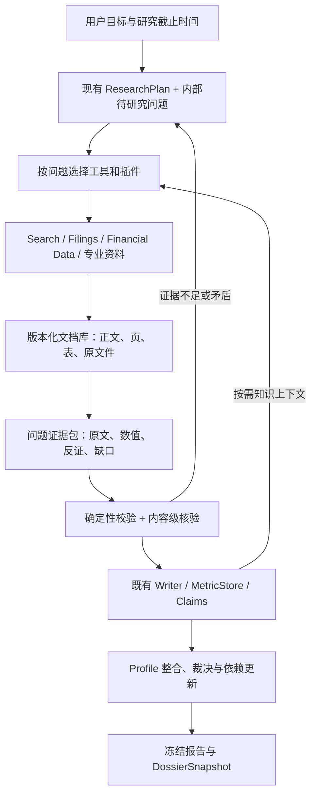

# Research / Profile：Tools 与 Plugins 能力提升方案

> 日期：2026-09-09。代码基线：`8777748`。
> 方法：当前源码静态审查、既有实施/事故文档对照，以及官方文档、作者工程文章和官方数据服务的网上检索。
> 本文的 Profile 指股票/行业投研档案。本文是设计方案，尚未实施；没有运行付费研究、购买数据服务或进行 ChatGPT Deep Research 同题实验。优先级是基于代码证据的工程判断，收益与工期是待验证的估计。

## 1. 建议与边界

建议保留当前 `DataGateway → EvidenceDesk → typed observations/claims/calculations → DossierSnapshot` 底座，把下一轮投入集中到五件事：

1. **让研究真正读到完整原文及其关键位置**：搜索用于发现资料，文档工具负责目录、正文、页、表、脚注和继续读取。
2. **让财务数字直接来自结构化披露或可定位单元格**：先完善 SEC XBRL 与 PDF 表格读取，再补电话会、指引和一致预期。
3. **让论断接受内容级核验**：检查原文是否支持结论，而不仅检查引用 ID 是否存在。
4. **让 research、profile、报告合成共享可检索的档案上下文**：复用已有 typed 数据，减少重复搜索和重新编写结论。
5. **用薄插件层统一装配、质量、预算和评测**：先包装现有能力，再接少量高价值 API/MCP。

这是增量升级。当前已有问题计划、并行 worker、预算、部分发布、数值血缘、快照和时态隔离，不需要更换整个 agent 框架。

不能用“接了 Deep Research API”推导“等同 ChatGPT Deep Research”。OpenAI 官方说明，ChatGPT 的研究流程还包含意图澄清与提示重写，而 API 需要调用方提供完整任务输入；专用研究模型支持 web/file search、特定 search/fetch MCP 和 code interpreter，不能直接承接项目全部自定义函数工具。因此应把它视为可选研究引擎和对照组，输出仍需通过项目的证据与档案准入。[OpenAI Deep Research 指南](https://developers.openai.com/api/docs/guides/deep-research)

## 2. 当前差距：哪些已实现，哪些仍限制效果

以下是本次直接核对的代码事实；不把旧事故中的已修问题当作当前缺陷。

| 能力 | 当前实现与证据 | 对产出的影响 | 建议优先级 |
| --- | --- | --- | --- |
| 搜索输入 | Exa 请求及结果都限制 1,200 字符；Tavily 固定 basic 并截断 1,200 字符。[Exa](../src/finance_agent/gateway/adapters/exa_search.py#L93)、[Tavily](../src/finance_agent/gateway/adapters/tavily.py#L55) | 适合发现来源，难以支撑脚注、商业机制和细致反证 | P0/P1 |
| 通用全文读取 | `read_edgar_filing` 实际能读取任意检索 chunk 的 URL，但接口命名/提示仍偏 SEC/HKEX；定位只做完整 query 的精确子串，无命中返回开头。[读取](../src/finance_agent/research/tools.py#L662)、[窗口](../src/finance_agent/research/tools.py#L91) | 容易错过正文深处的证据，也不利于模型发现工具适用范围 | P0/P1 |
| PDF/HTML | PDF 默认前 80 页，所有页合并为纯文本；HTML 删除标签和空白。已有乱码检测，尚无 OCR 修复及保结构解析。[fetch](../src/finance_agent/gateway/fetch.py#L42) | 页、表头、期间、单位和脚注可能丢失，80 页后的数据不可达 | P1 |
| 论断核验 | `propose_claim` 的 validated 主要来自引用可解析和作用域检查。[tools](../src/finance_agent/research/tools.py#L458) | 引用正确指向一段文字，仍可能不支持整句结论 | P0 |
| 研究评审 | rubric 收到 `IterationReport` JSON，主要是 ID、字段和计数，缺论断与原文。[loop](../src/finance_agent/research/loop.py#L810) | 无法充分判断一手证据、反证质量、推理跳跃和关键遗漏 | P0 |
| 来源质量 | `first_party_observations` 实际统计 PIT A。[assessment](../src/finance_agent/research/assessment.py#L173) | 时间可追溯与一手/权威来源被混用 | P0 |
| 知识复用 | S1 的 `query_kb` 主要返回 legacy value/time；typed 查询已在合成阶段实现，但尚未共用。[S1](../src/finance_agent/research/tools.py#L249)、[合成](../src/finance_agent/commands/steps.py#L617) | 研究和档案更新不能充分复用已有观测、论断、计算及其出处 | P0/P1 |
| Profile 更新 | S2 是最多 6 步的 `query_kb → propose_thesis`，主要读取旧 Fact；建档主体工作在 S1。[profile_update](../src/finance_agent/commands/steps.py#L1296) | 更新更像重写 thesis，缺少完整的整合、依赖失效和差异解释 | P1 |
| 旧事实冲突工具 | `keep_evidence_id` 进入说明，实际向 writer 传空 `keep_fact_id`，底层清除 conflict_flag。[工具](../src/finance_agent/research/tools.py#L267)、[store](../src/finance_agent/knowledge/store.py#L285) | 可显示冲突已处理，却没有真正选择与保存获胜事实 | P0 |
| SEC 数据 | 读取 submissions 的 recent 部分；未见专门 companyfacts/XBRL 工具及历史文件遍历。[edgar](../src/finance_agent/gateway/adapters/edgar.py#L62) | 可利用的结构化财务事实尚未成为主要输入 | P1 |
| 插件 | SourceAdapter 已有；源、schema、handler、STEP_MANIFEST 分散手工装配。MCP 仍在扩展文档中列为后置。[扩展说明](how-to-extend.md) | 扩展容易漏配，难以按任务组合、统一测量与冻结版本 | P1 |
| 研究策略 | plan 模式强调问题研究，但 worker 尾部仍附带先逐字段写入的纪律。[loop](../src/finance_agent/research/loop.py#L603) | 会把开放问题压回快速填字段，影响深度 | P0 |
| 上下文 | Kernel 每步从事件投影历史；已有按需 chunk 和请求去重，尚未有完整语义压缩。[kernel](../src/finance_agent/loop/kernel.py#L80) | 长任务中历史资料重复占用上下文和输入预算 | P1 |

补充：当前工具已经按 step 过滤，不是把所有工具一股脑交给所有 agent。应在此基础上继续增加按问题、市场和阶段的能力选择。

已有实施文档也明确：电话会/guidance/consensus、真实新旧效果盲评等仍待完成。本次没有复跑过去的研究，不能从旧事故统计推断当前耗时和质量。[实施状态](knowledge-dossier-implementation-status.md)

## 3. 网上最佳实践如何映射到本项目

| 已核实的一手实践 | 对项目的具体借鉴 | 不宜照搬的部分 |
| --- | --- | --- |
| Anthropic 研究系统采用主管与研究者分工，研究者反复搜索，主管决定是否继续并整合引用。[研究系统](https://www.anthropic.com/engineering/multi-agent-research-system) | 给现有 worker 增加明确的问题、证据包、反证和退出条件；主管按未解决问题再派发 | 厂商内部的提升比例、token 倍数不能用于预测本项目收益 |
| 工具应围绕高价值任务设计，名称明确，支持过滤、分页、精简返回和可处理的错误。[工具设计](https://www.anthropic.com/engineering/writing-tools-for-agents) | 合并重复封装；让参数表达期间、主体、来源类型、返回深度；把 error 与 empty 区分 | 不把每个供应商 endpoint 都变成 agent 可见工具 |
| 上下文按需加载，保留轻量标识，必要时读取原始材料。[上下文工程](https://www.anthropic.com/engineering/effective-context-engineering-for-ai-agents) | 保存文档和证据原件；worker 只拿问题相关内容，摘要保留可回读 ID | 摘要不能取代可引用原文，压缩不能覆盖事件日志 |
| LangChain Deep Agents 将大输出卸载到存储，通过子任务隔离上下文，并保留按需读取。[上下文文档](https://docs.langchain.com/oss/python/deepagents/context-engineering) | 复用这种设计思想，落到现有 eventstore/ChunkStore/MetricStore | 不因这个能力迁移整个框架；简单查询不必多 agent |
| Tavily 推荐先 Search、筛选，再 Extract；相关片段和完整内容有不同用途。[Extract 最佳实践](https://docs.tavily.com/documentation/best-practices/best-practices-extract) | 搜索结果用于排序，关键断言转入原文读取；显式记录是否部分内容 | 当前 basic/advanced 都可能返回相关片段，不能把参数名当正文完整性保证 |
| Exa 提供 text/highlights/summary 与内容时效控制。[当前指南](https://exa.ai/docs/reference/search-api-guide-for-coding-agents) | 开放有用参数并验证 Novita 透传兼容性；模型生成 summary 单独标记 | 旧 livecrawl 参数已弃用；新鲜网页内容不意味着具有历史 PIT |
| Docling 提供含文本、表格、层级和位置溯源的文档模型。[文档模型](https://docling-project.github.io/docling/concepts/docling_document/) | 用页、表、单元格定位接入已有 MetricSpec 和数值准入 | 不能因为启用解析器就默认扫描年报和跨页表准确 |
| MCP 有输入/输出 schema、structuredContent、分页工具清单和工具错误；annotations 是提示。[已核实规范](https://modelcontextprotocol.io/specification/2025-11-25/server/tools) | 桥接时校验结果并转为项目契约，锁定兼容版本 | `tools/list` 不等于语义发现，readOnlyHint 不等于宿主强制权限 |
| OpenAI 支持工具按需发现/加载；评估需任务化并与人工判断校准。[Tool search](https://developers.openai.com/api/docs/guides/tools-tool-search)、[评估实践](https://developers.openai.com/api/docs/guides/evaluation-best-practices) | 扩大目录时延迟加载；建立本地题集、消融与盲评 | 现有 OpenAI-compatible 多供应商接口不必然支持原生 tool_search；应用侧先实现过滤即可 |

## 4. 目标架构与共同数据契约



### 4.1 扩展现有 SourceDocument / Evidence，避免平行建库

新增字段应首先映射到现有 SourceDocument、chunk locator 和 typed observation；确需增加文档索引/原文件存储时，保存关联 ID，不再建立另一套事实真相源。

| 对象 | 需补齐的信息 |
| --- | --- |
| DocumentVersion | canonical_url、upstream_origin_id、publisher、source_type、主体标识、content_hash、原文件位置、解析器版本 |
| 时间证据 | published_at、retrieved_at、实际内容版本可知时间、时间精度、时区、PIT 方法、是否可变/历史快照 |
| 读取完整性 | total_pages、processed_pages、failed_pages、full/partial/truncated/failed、继续读取游标 |
| EvidenceSpan | document_version_id、section/page/bbox/table/row/column、原文、相邻上下文引用 |
| 来源质量 | 一手/二手、发行人/客户/监管/媒体等角色、转载族、独立性、抽取质量；与 PIT 分开 |
| Observation | 复用当前主体、期间、单位、币种、basis、nature、dimensions、转换血缘；补稳定单元格/JSON Pointer 定位 |

**时间准入必须与内容版本绑定。** 今天读取一个标注旧发布日期的网页，不能直接继承该日期并作为历史证据。不可变 filing、当前可编辑网页、已有历史快照要分开处理；历史评估只使用能证明截止时已存在的版本。SEC 只有日精度 filingDate 时，也不能随意当作 UTC 零点公开；优先取 acceptance 时间，缺失则保守处理。

### 4.2 问题证据包 EvidencePack

它是给 worker、verifier、S2 和合成器的共同输入，不是新的事实库：

```text
EvidencePack
  question_id / scope_entities / as_of / input_hash
  candidate_answer + atomic_claims
  supporting_spans[] / counter_spans[] / contextual_spans[]
  observation_refs[] / calculation_refs[]
  source_families[] / retrieval_attempts[]
  unresolved_conflicts[] / missing_evidence[] / next_actions[]
```

短版返回结论草案、原文摘录、关键数字和 ID；详细版按引用展开。摘要、供应商生成答案、其他 agent 的总结只作为分析材料，不能替代原始证据登记。

## 5. Tools 详细改造

下列是建议工具契约，不表示目前已可调用。研究者通常只暴露 6–10 个相关工具；内部可调用多个 adapter，批处理每项单独返回成功/失败和证据血缘。

### 5.1 搜索与文档工具：第一优先级

| 工具 | 关键参数 | 结果与行为 |
| --- | --- | --- |
| `search_sources` | query、question_id、entities、market、language、source_types、domains、date_range、depth、cursor | 来源 ID、URL、标题、出版者、日期及可信依据、短摘录、获取状态；供应商可替换 |
| `fetch_document` | source_ref、freshness、parser_mode | 获取并存档正文/原件，返回 document_version_id、目录、完整性和抽取质量；旧 read_edgar_filing 保兼容别名 |
| `search_document` | document_ids、query、section、page_range、top_k | BM25/关键词与可选向量召回，按需 rerank；返回相关段落及页/表位置 |
| `read_document` | document_version_id、locator、expand_context、max_tokens | 读取段落、章节、后续页、表头和脚注；明确是否还有未读内容 |
| `extract_table` | document_version_id、table/page、metric_specs | 原始表结构、单元格、表头、币种/期间候选及校验问题，不直接把不确定数字写成事实 |

实现顺序：

1. 先修工具名称、描述和分阶段策略，让现有非 SEC 全文能力可发现；显示 `snippet_only` 和截断标记。
2. 将抓取从工具闭包抽为文档服务；原件和规范正文按内容哈希保存，复用同版本，模型只接收目录和相关内容。
3. 先实现目录、关键词/BM25、邻接段扩展和页范围读取；再用题集判断 embedding/reranker 的净收益。避免一开始引入复杂向量基础设施。
4. PDF 取消不可继续的固定前 80 页读取：分批解析、保页码，读取失败返回失败页清单。重要表在后半部时必须可达。
5. Docling 作为结构解析首选试点；现有 pypdf 做轻量路径；只对低质量页做 OCR。用同一批中文扫描、跨页表和英文年报与 Unstructured 对照后再决定生产组合。[Docling](https://docling-project.github.io/docling/concepts/docling_document/)、[Unstructured 解析策略](https://docs.unstructured.io/open-source/concepts/partitioning-strategies)
6. 动态网页在普通抓取失败时启用隔离浏览器兜底；受登录或服务授权限制的来源返回 access_denied/unsupported，不把“访问失败”写成“公司未披露”。

SearchBroker 初版复用 Exa 为主、Tavily 为备。低召回、不同语言、重大争议时才双源合并；按 canonical URL、内容哈希和转载族去重，再排序。两个搜索引擎返回同一公告只算一个原始来源。参数、失败回退、缓存、限流和费用都写 trace。Exa 新参数在 Novita 通道需单独做契约验证，不能根据直连文档假设全部透传。[Exa 指南](https://exa.ai/docs/reference/search-api-guide-for-coding-agents)

### 5.2 财务和专业数据工具

| 工具 | 解决的问题 | 关键约束 |
| --- | --- | --- |
| `resolve_entity` | 名称、曾用名、ticker、CIK、交易所、公司与证券/ADR/子公司关系 | 模糊匹配返回候选和依据；不以同名自动合并 |
| `list_filings` | 报告类型、期间、历史 filings、附件、更正 | 保留 accession、公开时间、对应主体及原文链接 |
| `query_financial_facts` | 直接读取 XBRL/供应商结构化收入、现金流、资产负债 | 原始 tag、unit、期间、filing 版本完整；不直接取最后一条数值 |
| `query_earnings_materials` | 财报发布、电话会、演示材料、Q&A | 区分材料类型、speaker、时间和发行人/供应商来源 |
| `query_expectations` | 指引、consensus、历史修订 | guidance、consensus、模型预测三类隔离；有快照日期才讨论预期修订 |
| `search_domain_evidence` | 论文、试验登记、技术验证等行业材料 | 独立验证与公司自述分开；论文数量不直接变成护城河评分 |

受控 `calculate_metric` 和 Decimal 血缘继续作为关键数字计算入口。可选沙箱代码工具只用于探索、图表和大批量核对；若结果要进入正式档案，必须转换为有输入引用和算法版本的 CalculationRun。无需为此开放研究 agent 任意修改仓库或事实数据库。

### 5.3 统一知识与档案工具

把合成阶段现有 typed 查询抽为共享模块，供 S1/S2/合成使用：

- `get_research_context(entity, question_ids, as_of, snapshot_id, token_budget)`：按问题返回现有事实、观测、论断、计算、缺口、冲突和原文入口。
- `query_observations / query_claims / query_calculations`：增加主体、期间、指标、性质、问题、状态、快照过滤及游标，取代固定取前 200/100 条。
- `read_evidence(refs, include_context)`：批量读取原始证据和定位，不要求模型用搜索重新发现已存资料。
- `list_conflicts / adjudicate_conflict`：传 conflict_id、winner_ref、supporting_refs、rationale、base_version；校验语义键与证据关联后追加裁决，旧版本获胜时正确更新当前投影。
- `prepare_profile_update(base_snapshot, candidate_refs)`：返回待合并、重复、冲突、失效依赖和预期 diff。
- `commit_profile_update(change_set_id, expected_base_hash)`：宿主规则校验后幂等提交，仍经受控 writer；产生新快照和变化说明。

`as_of`、namespace、授权实体集合由运行上下文限制，模型参数只能进一步缩小范围。快照查询必须使用冻结输入，不能混入更新后的 live facts。

### 5.4 内容级 verifier

把当前状态分成独立字段：`references_valid`、`evidence_support`、`numeric_checks`、`analysis_review`。历史 validated 映射为“引用校验已过”，不能批量升级成事实核验已过。

`verify_claim` 读取 EvidencePack，而非仅接收 statement 和 ID。返回每个原子论断的 supported / partially_supported / contradicted / insufficient、对应原文 span、遗漏条件、期间/主体错配、来源独立性和下一步补查。其结果是可审计核验意见，不是绝对真值。

检查分工：

1. 程序硬检查：引用、主体、时间、单位、计算、权限、版本、冲突。
2. 内容检查：事实陈述是否被原文支持；推论是否有前提、推理边界、替代解释；假设是否被明确标记。
3. 针对关键结论寻找反证。没有找到反证时保存查过的来源和范围，不制造反对意见凑数。
4. 重大结论/异常数值做第二次独立提取或抽样人工核对。两个模型引用同一段材料不构成两个独立来源。

rubric 仍可提供软反馈；发布规则读取硬检查与内容核验结果决定 validated/partial/draft。不得用一个总评分抵消数值或引用硬失败。

## 6. Plugins 设计：先统一契约，再扩展生态

### 6.1 区分三种能力

- **数据插件**：Exa、SEC、HK 披露服务、财务供应商等，负责获取来源并归一化。
- **处理/研究插件**：PDF 解析、来源策略、反证研究、内容核验、档案整合、行业配方。
- **传输适配**：直接 Python/API 或 MCP。MCP 是接入协议，不自动提供金融语义、来源可信度或研究质量。

Codex/ChatGPT 插件目录中的安装只会配置对应宿主。项目要使用同一数据服务，仍需自己的 adapter 或 MCP 客户端、认证、字段映射及测试。Financial Datasets 官方也分别说明了交互客户端连接和生产程序 API-key 接入方式。[官方 MCP 说明](https://docs.financialdatasets.ai/mcp-server)

### 6.2 最小插件契约

先采用受版本控制的 Python 注册表和类型化 manifest，保持项目“代码即配置”的原则。无需首先开发任意代码热加载、插件商城或复杂依赖图调度器。

```yaml
# 提议的契约示意，不是现有可执行配置
id: source.sec
version: 0.1.0
api_version: finance-plugin-v1
kind: source
capabilities:
  - filings.search
  - documents.fetch
  - financials.xbrl
applies_to:
  markets: [US]
  stages: [research, profile]
requires: [documents.store, evidence.registry]
tools: [list_filings, query_financial_facts]
temporal_policy: per_record_verified
auth: configured_user_agent
network_policy: sec_endpoints
failure_policy: partial_with_reason
contract_tests: sec_source_v1
```

必须由宿主实现的能力：

| 部件 | 职责 | 交付验收 |
| --- | --- | --- |
| ToolDefinition | 同一对象声明 schema、handler、适用角色、输入/输出、读写性质、超时、预算 | 不再出现 schema 有而 handler 无、能力页与运行不一致 |
| PluginRegistry | 重名拒绝、依赖/版本检查、配置校验、按场景编译能力集合 | 缺凭证显示 unavailable 与原因；一个非关键源失败不阻断全部研究 |
| ToolExecutor | 参数/结果校验、并行读、限流、超时、重试、错误码、trace、预算 | 重试也扣预算；错误不被包装为空结果；写入使用幂等键 |
| Manifest freezing | 保存真实启用插件/工具/schema/recipe/parser 版本及配置哈希 | 同一 run 中不静默切换版本；密钥不进入事件和哈希原文 |
| Capabilities view | 从实际编译结果生成工具与插件展示 | 显示 enabled / missing_config / unsupported / degraded 与版本 |

内建强约束继续在宿主：DataGateway 时间准入、证据原文绑定、MetricSpec、ProfileWriter/TypedMetricWriter、namespace 与快照隔离。插件只能贡献数据/候选/核验意见，不能通过声明关闭这些约束。

第一版不必把所有阶段都改成通用 hook。优先把数据、文档解析、核验、档案整合四个接缝统一；只有真实第二个实现出现时再抽象。

### 6.3 MCP bridge

第一批仅接经过适配的只读服务。客户端执行 `tools/list`、schema 校验、allowlist、认证与超时处理，然后把 structuredContent 转成 Document/Evidence/Observation 候选。拒绝把远端自然语言答案直接当 verified Fact。[MCP Tools 规范](https://modelcontextprotocol.io/specification/2025-11-25/server/tools)

每个远端工具分别声明市场覆盖、原始来源、单位、期间、时效与 PIT 方法；没有可证明历史版本的快照数据，仅用于生产研究，不进入历史评估。`readOnlyHint` 只作辅助，真正可调用工具由宿主白名单控制。

保留直接 API adapter 作为核心数据的优先路径：能更明确控制过滤、版本、错误与来源。MCP 适用于快速验证新服务和连接内部资料，不要求所有已有 adapter 改写成 MCP。

### 6.4 首批插件组合

| 插件包 | 内容 | 顺序 |
| --- | --- | --- |
| `research.web` | Exa/Tavily、SearchBroker、来源类型和去重 | 第一批，包装已有能力 |
| `documents.reader` | HTML/PDF、目录/页/表、存档、分块、质量/OCR 路由 | 第一批，最大输入质量收益 |
| `source.sec` | CIK、完整 filing 历史、XBRL、公开时间与更正 | 第一批，美股优先 |
| `knowledge.context` | S1/S2/合成共用 typed 查询与 EvidencePack | 第一批 |
| `research.verifier` | 原子论断支持性、数值检查、反证闭环 | 第一批 |
| `profile.consolidator` | 版本、冲突、依赖失效、语义变化与快照 | 第一批 |
| `source.earnings` | 电话会、发行人业绩材料、指引提取、兑现时间线 | 第二批 |
| `source.consensus` | 估计快照、口径、覆盖人数、修订 | 第二批，先验证授权/覆盖/PIT |
| `source.disclosures_hk/cn` | 获授权公告接口、原文/历史附件、当地实体标识 | 第二批；HK 若是主战场应与 SEC 并行 |
| `research.ai_science` | 论文/试验、公司合作材料、外部技术验证、商业兑现证据矩阵 | 第二批，按任务加载 |
| `profile.refresh` | 新财报、管理层、监管等事件到受影响字段/问题 | 第三批 |
| `engine.deep_research` | 可选外部研究引擎，作为增补搜索与对照 | 第三批，不能绕过本地核验 |

## 7. 数据服务选型与接入决策

### 7.1 推荐组合

| 需求 | 优先选择 | 需要验证的限制 | 决策 |
| --- | --- | --- | --- |
| 通用网络检索 | 现有 Exa + Tavily | A/H/US 目标的优质来源召回、中文检索、全文成功率、Novita 兼容性 | 先把两家用完整；暂不引入第三家搜索 |
| 美股原始财务 | SEC submissions + companyfacts + filing 原件 | 自定义 taxonomy、分部 KPI、期间口径、更正；后端缓存/限流 | 必做，性价比高 |
| 美股结构化财务与出处 | Financial Datasets 作为候选 | 标的/历史覆盖、错误率、源文件回指、价格和使用权；服务有出处不等于其所有字段具备 PIT | 与自建 SEC 做小样本对照后决定 |
| 电话会/一致预期 | 发行人 IR + FMP 对应接口作为候选 | 小盘/港股覆盖、speaker、GAAP/non-GAAP、snapshot date、历史预期及套餐权限 | 电话会优先于一般新闻扩容；不假设一个套餐覆盖全部 |
| 港股正式公告 | HKEX IIS 或获授权供应商；许可允许的发行人 IR | 历史范围、缓存、再分发、费用与服务稳定性 | 替换“匿名爬虫稳定可用”的假设 |
| A 股披露 | 巨潮/深证信正式数据产品或授权供应商 | 公告/问询/调研记录端点、账号权限、历史和配额 | 若 A 股不是当前重点，可后置；不拿行情快照代替披露 |
| 行业技术证据 | OpenAlex；生物医药加 ClinicalTrials.gov | 论文全文不一定可得，作者/公司匹配不确定；试验记录可修订 | AI for Science 配方按需接入 |
| 已有内部资料 | 项目文档库，必要时再接 Notion/Drive 等来源 | 资料权限、版本、来源及查询范围 | 有真实资料积累时才建 connector |

来源与事实边界：

- SEC 官方 JSON API 支持 submissions 和 XBRL；companyfacts 聚合范围有边界，自定义和分部信息仍可能需要原始 filing。官方要求总体请求速率不超过 10 req/s，大量采集可用批量数据。[SEC API](https://www.sec.gov/search-filings/edgar-application-programming-interfaces)、[开发者资源](https://www.sec.gov/about/developer-resources)
- Financial Datasets 的财务接口展示 filing URL、accession 与 filing datetime 等字段，适合作为可追溯结构化输入候选；其准确性仍需本地验收。[财报接口](https://docs.financialdatasets.ai/api/financials/all-financial-statements)、[来源说明](https://docs.financialdatasets.ai/data-provenance)
- FMP 官方提供 analyst estimates 和 earnings call transcript 产品。当前文档能证明产品存在，不能证明你的套餐、所需港股、历史快照及再分发权限已获支持。[Estimates](https://site.financialmodelingprep.com/developer/docs/stable/financial-estimates)、[Transcripts](https://site.financialmodelingprep.com/datasets/earnings-call-transcripts)
- HKEXnews 的公开条款限制程序化访问/抓取/文本数据挖掘；HKEX 另提供 Issuer Information feed Service。此处据此提出来源接入方案，具体使用范围以服务授权为准。[Terms](https://www2.hkexnews.hk/Global/Exchange/Terms-of-Use?sc_lang=en)、[IIS](https://www.hkex.com.hk/Services/Market-Data-Services/Infrastructure/Issuer-Information-feed-Service-(IIS)?sc_lang=en)
- 巨潮官方页面列出数据 API/数据产品入口，本次未取得账号权限验证，不声明为免费匿名稳定 API。[巨潮](https://list.cninfo.com.cn/cninfo/new/index)、[深证信](https://webapi.cninfo.com.cn/)
- OpenAlex 可搜索学术作品并按结构字段筛选；ClinicalTrials.gov 提供研究记录 API。两者支持技术证据发现，无法单独证明公司商业成功。[OpenAlex](https://help.openalex.org/api/searching/)、[ClinicalTrials.gov](https://clinicaltrials.gov/data-api/api)

### 7.2 如何决定付费接哪一家

每个候选服务先提交一份供应商验收卡：目标 ticker 清单、市场与历史覆盖、20 个真实查询结果、来源定位、数据可知时间、空值和更正行为、失败码、限流、单次成本、允许存储/展示范围。抽样与原始披露逐字段对照。

美国基本面先比较 **自建 SEC 与 Financial Datasets**；电话会/预期先比较 **发行人材料与 FMP**。两项解决不同问题，不必只选一家，也不需要全部采购。港股单独验收，不能以美国大盘股样本代表。

本轮不沿用旧文档中的历史套餐价格或免费额度作为预算依据。按本次未实际调用的商业 API，价格、权限和可用性均为接入前检查项。对当前目标，优先花钱改善全文、表格、电话会和预期的可得性，暂缓行情/交易执行类插件扩容。

## 8. Research 流程改进：让工具产生有效研究

### 8.1 冻结目标，允许内部研究路径演进

保留冻结 ResearchPlan 的用户目标、市场、时间、输出要求和预算。新增有版本的内部子问题/待查线索列表，记录 parent_question_id、触发证据、优先级、成本和退出条件；不允许自动扩大投资范围或预算。

例如目标是“哪些公司已形成护城河且可能商业爆发”：行业背景不足以算答完。每家候选应形成技术证据、商业兑现、竞争替代、现金消耗、反证和验证事件的对照。

每个问题的循环为：

```text
已有知识与缺口 → 来源路线 → 搜索 → 重要资料精读
→ 证据包 → 指标/比较/反证 → 内容核验
→ 回答问题或给出明确缺口 → 更新 Profile / 报告
```

有 plan 时移除“必须先逐字段立即写入”的重复纪律；legacy 补字段模式才保留旧策略。用 `submit_question_result` 批量提交观测/论断候选与答案，内部继续逐项运行现有 gate，返回具体拒绝原因，减少纯机械工具往返。

### 8.2 来源路线按问题选择

| 问题 | 优先来源链 | 交付形式 |
| --- | --- | --- |
| 收入、利润、现金流 | 正式报表/XBRL → 脚注 → 同口径计算 | Observation + CalculationRun |
| 技术护城河 | 公司技术材料 → 外部实验/论文/客户验证 → 替代路线 | Claim + 支持/反证 + 限制 |
| 商业爆发 | 分部收入/客户/订单 → 电话会 → 收款与收入确认 → 现金能力 | 证据矩阵，区分事实与条件推论 |
| 管理层兑现 | 历史承诺/指引 → 当时可知时间 → 对应期实际披露 | Guidance-to-actual 时间线 |
| 市场空间和份额 | 明确定义与分母 → 一手统计/披露 → 范围与估计方法 | 同口径比较；不可比明确原因 |
| 行业候选池 | 行业证据 → 公司/证券实体校验 → 收入相关度 → 排除理由 | CandidateAssessment |

资料之间冲突时，先查是否来自不同期间、主体、币种、GAAP 口径或合同定义；不能直接对两个数取平均，也不能靠模型投票选“看起来合理”的数。

### 8.3 并行、停止与上下文

- 当前并行架构继续使用；真正独立的公司/问题才并行。同一财报尽量抓取解析一次，各 worker 共享只读文档引用。
- 单问题窄查询可以一个 worker 完成；对比/多市场再分工。公开实践也强调按任务形态控制拆分。[LangChain 研究示例](https://docs.langchain.com/oss/python/deepagents/deep-research)
- 利用已有 RunBudget，对检索、抓取/OCR、LLM、重试和子任务统一扣费/限时。初始建议预留 15%–20% 总预算给核验与合成；这是待实验调优的配置。
- 停滞区分“没有新事实”“检索无新资料”“核验一直失败”“源不可达”。只有登记事实才算进展会惩罚必要的精读与证伪；可增加新高价值证据、关键冲突消除等进展信号。
- 连续低收益时执行有界的改写查询、换来源、精读附件；仍不足就发布 partial 和具体缺口。来源数量不作为强制凑数指标。
- 上下文压缩保留目标、已知证据 ID、重要原文定位、未解决冲突、当前假设和下一步；将压缩结果与来源事件区间/hash 记录为新事件，不删除原日志，确保可重建。

## 9. Profile 应升级为持续维护的研究资产

### 9.1 S2 变为整合与更新阶段

`profile_update` 从重写 thesis 扩展为：读取冻结基线 → 汇总本轮候选 → 语义去重 → 期间/单位检查 → 冲突裁决 → 依赖失效/重算 → 更新论断与缺口 → 生成可解释 diff → 冻结快照。

事实和分析保持分层。建议新 thesis 修订保存为带证据与前提的 Claim/Artifact；旧 `thesis` Fact 仅作为兼容投影。对依赖旧格式的 decision 入口，先做适配和回归，不直接删旧数据。

### 9.2 档案按“研究是否有用”衡量

| 内容 | 需要的材料/工具 | 完成要求 |
| --- | --- | --- |
| 主体与业务结构 | entity resolution、分部披露、公司关系 | 公司/证券/子公司分开，业务收入归属明确 |
| 财务质量 | XBRL、现金流、脚注、同口径计算 | 期间/单位一致，关键数值可回到原件 |
| 核心经营 KPI | 行业 MetricSpec、分部/客户/订单 | 经济含义明确，不能把合作潜在总额等同已确认收入 |
| 护城河与竞争 | 多类技术/客户/同业证据 | 给优势机制、替代解释及反证，避免形容词堆叠 |
| 管理层与预期 | 电话会、历史指引、实际财报 | 承诺时间与验证期间匹配；consensus 缺失就标缺失 |
| 催化剂与风险 | 监管、披露、事件和问题关联 | 触发条件、验证时间、受影响 claim 可定位 |
| 研究变化 | snapshot diff + dependency graph | 解释哪些数据、结论、置信程度或待验证条件发生变化 |

完整度不再仅看字段有值。展示有效问题覆盖、关键数字可靠性、证据支持状态、未知项和时效；遇到无披露或不可比，保留 unknown，不为了评分补造内容。

### 9.3 增量刷新与依赖

建立 `document → observation → calculation → claim → module` 依赖边，优先复用当前引用关系。新财报/更正到达，只更新受影响的指标、计算和问题；管理层或监管事件触发相应模块刷新。

依赖改变时，新版本 claim 标 stale/review_required 或产生 revision，旧快照保持原样。没有证据表明观点变化时，不能把“新增一条重复资料”显示为新投资发现。

第一期用用户触发的 refresh 和确定性增量更新跑通；定时监控是后续产品能力，不在本方案阶段自动创建监控任务。

## 10. 与 ChatGPT Deep Research 对照的评估方案

当前没有同题、同条件对照数据，因此不能承诺具体追平比例。用实验回答：资料覆盖、精读、核验、知识复用各贡献了多少，剩余差距是否来自模型和研究策略。

### 10.1 题集与组别

先选 6 个哨兵任务跑通，再形成 24 题：12 个单股、8 个行业/多公司比较、4 个历史档案增量刷新；覆盖美港股及项目真实失败场景，若 A 股是产品范围则加入相应样本。16 题用于迭代，8 题留作未见验收；关键任务至少重复 3 次测波动。

哨兵任务建议：BE 财务与订单口径、2228.HK 中文财报/合同定义、AI for Science 技术与商业兑现、财报更正、80 页后关键表格、电话会指引与实际兑现。冻结题目、目标、截止时间、允许来源与期望产物，不预设公司结论。

| 对照组 | 保持不变/改变 | 回答的问题 |
| --- | --- | --- |
| A 当前基线 | 固定模型、提示、版本、预算 | 当前真实表现是什么 |
| B 仅工具改善 | 同模型/任务，升级文档读取和数据；必要提示改动单独记录 | 资料和工具对质量的增益 |
| C 工具+流程 | B 加 EvidencePack、核验、统一知识读取、profile 整合 | 闭环机制额外贡献 |
| D 外部研究引擎 | 同题运行 API 候选；ChatGPT 报告另作用户体验参照 | 剩余差距与产品级上限 |

分两类测试：固定文档集测试可隔离推理/抽取能力；开放网络测试保留完整检索日志，观察发现能力和时效。ChatGPT 产品内部模型、检索预算和工具未必可控，不能把它当作严格同成本消融，也不能把它的报告当事实真值。

### 10.2 指标与首轮验收目标

以下数值是建议的工程验收目标，需先测 baseline 后冻结；不是已达结果或通行行业标准。

| 指标 | 定义 | 初始目标 |
| --- | --- | --- |
| 关键来源召回 Recall@20 | 已标注关键材料中进入前 20 个候选的比例 | ≥85%，按市场和来源类型分桶 |
| 原文可获取率 | 合法可访问样本中成功获得所需原文的比例 | ≥90%；付费/权限失败单列 |
| 关键数值准确率 | value + subject + period + unit + currency + basis 全部正确 | ≥98%；主体错置/量级错置哨兵必须 0 |
| 引用可解析率 | 正式发布引用能定位到保存原文的比例 | 100% |
| 引用语义支持率 | 人工核验的事实断言获得充分支持的比例 | ≥95%；推论另评前提与推理边界 |
| 有效问题覆盖 | 按预先权重计算充分回答问题的比例 | ≥85%；unavailable 不算已回答 |
| 反证检查覆盖 | 关键结论完成过有记录的反证检索/核验比例 | 100%；无需强行找到反方资料 |
| 历史与快照正确性 | 未来内容/错版本/跨主体污染 | 固定回归集为 0 |
| 重复资料率 | 同一原始来源族重复输入的比例 | 较 baseline 降低 ≥50% |
| 成本效率 | 每个有效已回答问题的总成本、工具/LLM费用分项 | 同预算质量提升；不只看单次工具价格 |
| 体验 | 首个有效产物时间、最终时长、取消/失败后保留成果 | 用现有模式 deadline；无静默丢失 |
| 盲评 | 隐去来源组别、随机顺序，由至少两位评审按同 rubric 比较 | C 相比 A 胜率目标 ≥70%，同时报告样本数、平局和不确定区间 |

区分事实核验题和开放分析题；评审者需要访问报告对应的证据原件。LLM judge 用人工标注子集校准，不能由生产同一模型给自己的输出打分决定验收。小样本胜率只支持阶段决策，不证明普遍追平。[任务化评估与人工校准](https://developers.openai.com/api/docs/guides/evaluation-best-practices)

插件消融至少做：关闭第二搜索源、关闭高级 PDF 解析、关闭内容 verifier、关闭知识复用。保留能改善质量/成本曲线的组件，删除没有净收益的复杂性。

## 11. 实施顺序、代码落点和工作量

下面是工程估计：约 **30–46 人日**，两人并行约 **4–6 周**；取决于现有测试可复用程度和目标市场。供应商签约/权限等待、完整 A 股接入和复杂 OCR 长尾不计在内。无需等全部完成才交付。

| 阶段 | 工程包与落点 | 交付/验收 | 估计 |
| --- | --- | --- | --- |
| P0 可信度与策略 | 修改 research/tools.py、assessment.py、loop.py、knowledge/store.py；修旧冲突工具、validated 语义、PIT/一手分离、plan 字段纪律；6 题基线 | 非支持引用不可显示事实已核验；冲突真正选择版本；基线可回放 | 3–5 人日 |
| P1-A 文档与搜索 | 扩 gateway/fetch.py、adapters、EvidenceDesk；新增文档服务、目录/页/表、全文内搜索、结构解析试点 | 80 页后表格可达、原文可定位、截断透明、去重与失败码 | 5–7 人日 |
| P1-B 结构化披露 | 增强 edgar.py；实体、历史 submissions、XBRL、公开时间、更正 | 财务数字与原 filing 抽样对账，错期间/单位回归通过 | 3–5 人日 |
| P1-C 共用上下文与薄插件层 | 从 commands/steps.py 提取 typed 查询；新增 registry/contracts/executor；能力页从编译结果生成 | 现有源迁移不改变行为；S1/S2/合成都可按 ID 复用 typed 数据 | 4–6 人日 |
| P2-A 证据核验与研究路径 | 新 EvidencePack/verifier，调整 rubric 输入与内部子问题；压缩投影 | 错引、缺限定条件、转载伪独立等样本被识别；压缩可重建 | 5–7 人日 |
| P2-B Profile 与垂直数据 | S2 consolidator、依赖失效、语义 diff；电话会/指引；一项供应商验证及 HK 接入 spike | 重跑幂等、旧快照不变、指引/实际分离、缺源明确降级 | 5–8 人日 |
| P3 效果验收 | 24 题、消融、盲评、开关与回滚、按源/市场质量仪表 | 产出可复查的质量/成本对照，不以测试数量替代研究质量 | 5–8 人日 |

依赖关系：P1-A 与 P1-B 可以并行；先稳定证据契约，再扩 P1-C；P2 核验和档案更新建立在可回读原文与统一知识接口上。第一周即应完成 P0 和一条 search→fetch→定位→引用的垂直样例。

建议 PR 按小闭环拆：

1. `claim/conflict/source-quality`：修核验状态和旧冲突工具。
2. `shared-knowledge-tools`：贯通 typed 读取与证据包基础。
3. `document-read-v2`：通用读取、目录、分页、完整性、兼容别名。
4. `document-tables`：表格定位与解析/OCR 条件回退。
5. `sec-financial-facts`：XBRL、历史和公开时间。
6. `plugin-registry`：迁移内建源/工具，生成能力清单。
7. `evidence-verifier`：内容核验、反证、rubric 新输入。
8. `profile-consolidator`：更新集、裁决、依赖、快照变化。
9. `earnings-source-pilot`：电话会/指引及供应商验证。
10. `research-quality-benchmark`：固化对照结果与默认组合。

### 11.1 验证与迁移要求

每个新源都有离线契约夹具，并有经过授权的少量网络冒烟；不把真实网络依赖塞进单元测试。沿用项目失败可见性的事件、日志、API/UI 三通道，以及 CLI/HTTP 真实装配测试。

关键测试场景：无全文、被拒访问、日期缺失、网页更新、重复转载、旧 filing 更正、千/百万和比例混淆、后半部 PDF、跨页表头、typed-only 档案、错误引用、伪冲突裁决、快照基线过期、取消与部分成果、重试预算、压缩前后上下文一致性。

新字段/存储采用 additive migration；旧工具保别名、旧 thesis 保兼容读。按文档读取、核验、profile 整合分别设能力开关，回滚只切执行路径，不删除历史观测与快照。

### 11.2 最值得先做的范围

如果只启动一轮开发，建议交付 **P0 + 统一知识读取 + Document Read v2 + SEC 财务工具 + 6 题对照**。这组能同时改善原文输入、数字可靠性、已有知识复用和结论质量信号，且大部分不依赖新商业账号。

之后根据失败分布决定资金投入：原文拿不到补来源；表格抽错补解析；关键问题未答好补研究策略和模型；重复研究成本高补上下文与增量更新。不要在没有测量前把剩余差距全部归因于模型，或全部归因于插件数量。
